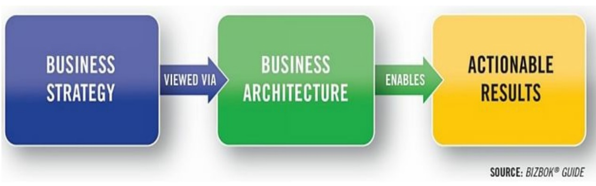

     每个企业都有一个业务架构；业务架构是否被清楚地表达出来并被有效地利用，完全是另一回事。那些已经阐明其业务架构并相应利用它的企业，已经并将继续从相对较少的时间、资本和资源投资中获得深远的价值。虽然业务架构是一门基于一系列简单原则的简单学科，但它已经并将继续对组织和这些组织所处的商业生态产生深远影响。本章节概述了业务架构背后的原因、它是什么、关键的差异化因素以及为什么要追求它，从而为各组织提供动力，使其加入全世界越来越多的企业名单，获得其回报和利益。

## 为什么需要业务架构？

​       在继续讨论业务架构的细节之前，考虑一下企业在试图解决无数的威胁和弱势时普遍面临的一个主要障碍。大多数高管可以列举出他们的组织所经历的一系列挑战。这些问题通常包括竞争加剧、运营成本上升、渠道准入限制、监管挑战、基础设施老化、缺乏技术资源、市场萎缩、供应链崩溃以及无法利用新技术。

​       寻求解决这些和其他挑战的组织有一个共同的主要障碍：不能以协调的方式行动，缺乏一个共同理解的目标，跨越多个业务单元和管理层次，实现一个共同的目标和整合的解决方案。结果是，解决方案没有达到目标，成本太高，整合性差，耗时太长，部署不力，而且往往在起步之前就已经失败了。过去的教诲在这方面提供了教训。

​         "任何理论的首要任务是澄清混乱的术语和概念，甚至可以说，已经完全纠缠在一起。只有在就术语和概念达成一致之后，我们才有希望轻松而清晰地考虑问题，并期望分享相同的观点......" "论战争"，卡尔-冯-克劳塞维茨，1833年

​       普鲁士将军和军事理论家卡尔-冯-克劳塞维茨表明，如果行政人员计划在共同战略的基础上应对共同挑战，他们必须确保所涉及的术语和概念绝对清晰。当一个解决方案需要跨业务单元和利益相关者进行协调和沟通时，这种标准化就显得尤为重要。当一个团队拥有共同的语言和观点时，参与这项工作的每个人都将有能力接受和迎接挑战--无论大小。换句话说，如果一个企业能够在纵向和横向的角度上清晰地阐述概念，不管涉及的任务是什么，也不管这些任务来自哪里，问题就会变得更容易解决，误解就会降到最低，协调就会简化，战略也会更容易实现。

​      今天的现实与这一愿景形成了鲜明的对比。大多数企业在不同的业务单元有多种方言，这使得一个通用的解决方案几乎不可能被部署在一个狭窄的业务截面之外。例如，企业在定义 "客户 "一词时很费劲，并且在阐明价值交付和相关的参与点方面面临挑战。此外，业务单元往往对客户有一个孤立的视角，特别是跨业务单元时，往往造成客户缺乏透明度，这样对于客户和整个企业都是一种痛苦。

​       这个看似简单的问题在各业务单元之间产生了涟漪，引发了多种不协调的解决方案，同时增加了成本并降低了客户满意度。随着生态系统在各业务单元、合作伙伴和地域间的扩展，问题也随之升级。这反过来又造成了严重的沟通和协调瓶颈，引发了协调不力的举措和投资，使全球企业每年损失数十亿美元。

​       一个有活力的企业必须明确产品、客户、合作伙伴、资产、政策、账户、协议、车辆、位置、运输、库存、行程、法律程序和付款等概念，以及这些概念的关系。一个企业也应该对如何与客户、合作伙伴和内部利益相关者接触，以提供商业价值的端到端观点有共同的理解。不幸的是，这些基础部分往往缺乏共识，这就是问题开始并继续升级的原因。

​       如果一个企业真的缺乏这种清晰性，那么商学院肯定会提供解决这些问题的工具。商学院传统会专注于竞争分析、战略规划、组织设计、价值链分析、知识管理和相关学科。这些学科在各自的关注范围内工作良好，但很少以协调的方式工作。更重要的是，这些学科中的每一个都做出了同样的假设--每一个学科的从业者都对业务有一个明确的、高度透明的理解。这种假设并不总是如此。幸运的是，学术界正在取得进展，因为一些大学现在正在提供业务架构课程，以解决这种跨业务透明度的限制。

​        这些问题在实践中是如何体现的？调查一个普通公司的中层管理人员，以确定他们每天花在缺乏共同理解基础和没有明确结果的会议上的时间百分比。当几个项目负责人发现有多个项目正在进行，而这些项目都是针对他们自己项目的相同问题时，听听他们所表达的挫败感。此外，当他们发现所有的项目都在争夺同样稀缺的预算时，听听项目负责人的反应。考虑一下有多少业务需求缺乏明确的重点和范围，与其他需求相冲突，导致多次努力返工的结果，并最终阻碍了业务价值的交付。最后，问问企业高管们，昂贵的IT解决方案在实现优先业务目标方面的效果如何。

​        这种缺乏共同观点的情况是企业无法应对越来越多挑战的根本原因。考虑一个将在五个部门实施的战略计划。高层管理人员将指令顺着指挥系统传递给他们的业务单元，导致每个业务单元投资于政策调整、产品计划、客户参与、工作流程、组织设计和技术等项目。各个业务单元制定独立的解决方案，几乎没有横向透明度。这反过来又创造了相互冲突、整合性差、高度冗余的解决方案，而对相互依赖性的了解却很少。结果变得不可靠，客户变得沮丧，相关的成本爆炸，甚至结果变得难以预测。

​       有一种倾向是将上述许多问题归咎于信息技术或IT组织。技术实施和IT本身只是反映了由于缺乏一个共同的业务视角而产生的混乱。解决这种缺乏明确性和一致性的问题是业务单元的责任，应该在投资相关技术相关之前提前解决。换句话说，这是一个业务问题，而不是一个技术问题，所有对敏捷技术、云计算、新技术和其他方法和工具的下游投资都不会使这个问题消失。

## 消除业务视角的误区

​         一个企业如何才能将冯-克劳斯维茨所描述的 "纠缠不清的术语和概念 "解耦并加以澄清，以应对上述挑战？考虑到每个企业在其核心层面都有一系列基础构建块，使企业既独特又在理想的情况下成功；把这些构建块称为企业的DNA。随着时间的推移，这些业务构建块变得越来越多地被复制，越来越分散，越来越不透明，导致了这样一种情况：企业只能把它的客户、合作伙伴、产品、举措和投资看作是零散的碎片的集合，这反过来又破坏了战略和投资。

​       这种现象是由于日益孤立的业务结构随着时间的推移而变得越来越复杂，每个业务单元都在创造自己的术语和概念词典。如果再加上兼并、收购和区域扩张，业务复杂性就会成倍增加。然而，就其核心而言，一个企业仍然有一套有限的基本构建块来代表它的工作。图1.1左边的积木例子代表了一个企业对其业务生态系统的理解是脱节的、不透明的，这破坏了其优化利益相关者价值、监管合规、创新、数字化转型和其他核心战略的能力。

​        一个希望对其业务生态系统有一个高度透明视图的企业，将寻求对其基本的业务构建块进行区分，如图1.1右侧所示，建立一个简明的、定义明确的、高度合理化的客户、账户、协议、合作伙伴、产品、资产以及相关概念和关系的观点。随着这种清晰性在各业务单元的出现，它允许企业作为一个有凝聚力的整体运作，以新的和创新的方式最大化利益相关者的价值交付和相关投资，同时使企业在发展过程中更加灵活。

​        在业务架构术语中，这些构建块被称为 "能力"。能力代表了一个极其重要的业务架构 "领域"。当与利益相关者的价值交付（或业务架构所称的 "价值流"）、信息、组织、战略、政策、举措、产品和利益相关者领域结合在一起时，能力构成了解决各种业务场景的基础，无论是转型还是其他。

​        价值流的框架总是代表企业如何向其客户、合作伙伴和内部利益相关者提供端到端的价值--在所有情况下都有一个明确的价值主张。存在于各业务单元和合作伙伴领域并依赖于某些信息的能力，使利益相关者的价值得以交付。它们共同构成了业务架构的精髓，在其简单性方面很优雅，但在其作为任何规模的转型的焦点的能力方面很强大。

## 业务架构的价值主张

​        业务架构的价值主张在于它能够通过向企业提供纵向和横向的透明度来解决上述的沟通和协作的障碍。在这种情况下，业务架构允许规划、投资和部署团队放大一个问题，然后再放大以评估整个业务的相关影响。根据BIZBOK®指南。

​        "业务架构的价值在于为企业和它所处的业务生态系统提供一个抽象的表示。通过这样做，业务架构作为一个有效的沟通和分析框架提供了价值，将战略转化为可操作的举措。该框架还增强了企业的能力，使其能够进行转型变革、驾驭复杂性、降低风险、做出更明智的决定、使不同的利益相关者与未来的共同愿景保持一致，并更有效地利用技术。"

​         图1.2描述了一个企业如何通过业务架构的视角将战略可视化。业务架构不是直接从战略跳到众多协调性差的投资，而是让高管们通过一个共同的视角来看待业务目标的截面。这反过来又使他们能够在早期确定可行的方案，并在开始就否定不可持续的方案。这种方法也使高管们能够以一种优化各业务单元投资的方式来构建举措，并确保解决方案由明确定义的业务专家来驱动。

具体来说，业务架构减少了与规划、投资分析、举措定义、跨业务单元协作、执行和部署各种业务举措相关的时间，并提高了准确性，包括。

- 使战略与执行对齐，通过保持对可衡量目标的关注来产生结果 
- 减少与局势分析和选择相关的时间和成本 
- 为整个企业的转型规划和执行带来清晰度和透明度 
- 使整个投资组合的投资决策更加明智，以及避免冲突、冗余和相关的不良投资选择 
- 为一个特定举措制定业务焦点和范围，确保相关的举措是一致的，并明确范围的划分和叠加
- 通过优化跨业务视角，提高运营效率，降低费用
- 确保IT战略和架构与业务战略保持一致
-  精简和优化跨业务的共性，消除或减少冗余，以实现业务单元的整合、兼并和收购。

##  为什么业务架构是不同的？

管理层经常会问，是什么让业务架构与任何其他学科（如战略规划、客户体验、产品规划、业务流程管理、精益六西格玛、敏捷或企业架构）不同？业务架构与这些学科有许多不同之处，其中之一是它能增强其他学科的实践，使从业者能够充分地将其价值最大化。下面的列表强调了这些差异化因素。

- **业务架构是基础性的，广泛适用于无数的举措和场景**。它为业务规划、战略部署、解决方案的定义和交付以及其他一系列的转型工作奠定了长期基础。例如，在建筑行业，我们可以把这个概念比作场地准备和打地基。这些准备步骤并不能提供一个完整的建筑，但它们对于建立一个鲁棒的架构是至关重要的，因为这个建筑将跨越几代人。业务架构为业务场景、举措和转型建立了一个类似的基础，它将长期超越这些受时间限制的活动。
- **业务架构是可复用的。**关于业务架构的一个常见的误解是，它与一个特定的举措、业务单元、投资或战略相关联，这意味着它需要被多次重建。恰恰相反，当有效部署时，企业会阐明基本的业务架构，并在多个投资、举措和业务单元中长期重复使用。由于这个原因，对业务架构的投资会反复多次得到回报。
- **业务架构与政治无关**。业务战略和投资常常被政治影响和业务单元的隔离所蒙蔽。然而，挑战、解决方案和相关的投资却跨越了业务单元和相关的权力中心，因此，需要非政治性的选择和解决方案。业务架构看待企业的主要方式与政治结构无关，但企业作为一个整体能使高管们设想出更可持续的投资和解决方案。
- **业务架构可在水平和垂直方向上扩展**。在进行一项举措时，管理层通常会告诫不要承担一个无法管理的范围。事实是，大多数规划团队不能 "只见树木不见森林"，而且由于缺乏业务透明度，常常不能实现业务目标。业务架构为规划工作提供了这种全面的视角，同时允许从业人员根据需要进行深入研究，以确保提供符合要求的一致的解决方案。
- **业务架构并不局限于内部观点。**大多数学科都是由内而外或由外而内地看待业务。业务架构两者都做，但一个重要的观点是，它能够通过客户、合作伙伴和其他外部利益相关者的视角，在每个参与层次上观察业务。这种独特的能力消除了在定义产品战略、客户相关投资、合作伙伴参与和相关解决方案方面的盲点或差距。
- **业务架构改善了其他学科。**BIZBOK®指南就如何在其他学科的背景下利用业务架构提供了指导。例如，业务架构被用来解释战略地图、业务模型和组合管理，以提供可操作的观点。同样地，业务架构也可被用来构建举措定义、设计工作、业务需求、业务流程建模以及数据和解决方案架构。总之，业务架构通过改善其他学科的有效性和及时性来提供价值。

## 业务生态系统的可视化 

业务架构为业务生态系统带来了透明度，业务生态系统被定义为：

​       "一个或多个法律实体，全部或部分,作为个人和资产的综合体而存在，或其集合体，作为一个有凝聚力的整体为一个共同的使命或目的而互动"[3]。

​        价值流是在业务架构内构建利益相关者价值交付的一个关键工具，提供了对生态系统范围的洞察。例如，一个与 "旅行 "价值流相关的航空公司生态系统将包括与该价值流相关的所有能力、产品以及内部和外部利益相关者。同样，一家保险公司的 "解决索赔 "价值流将包括外部利益相关者，如代理人、医疗保健提供者和药房。生态系统的定义对于确保业务架构的范围不被内部业务观点或业务单元的孤岛所限制或制约至关重要。

​        通过业务架构将业务生态系统可视化，利用被称为业务领域的相关业务视角的横截面。一个行业范围内的业务架构的定义指出：

​       "业务架构代表了关于能力、端到端价值交付、信息和组织结构的整体的、多维的业务观点；以及这些业务观点和战略、产品、政策、举措和利益相关者之间的关系。“[4]

​       这个定义提供了一个全面的业务视图，如图1.3所强调。这些业务生态系统的每一个 "抽象 "都代表一个业务领域，如能力、组织、价值流和信息。这四个领域构成了内圈的核心业务架构。外圈将核心业务领域与政策、战略、产品、利益相关者、举措和指标联系起来。

​																						图1-3 业务生态视角下的业务架构

图1.3中表示的业务领域以各种方式相互关联。例如，一个企业被分解成多个业务单元，每个单元都有一定的能力。能力促成了价值流，并需要某些信息。同样地，战略影响着某些能力，产品需要某些能力，而举措则影响着能力和价值流的交叉部分。阐明这些业务领域和关系是阐明业务架构的基础，并在各种业务场景中利用它。

## **业务架构框架™** 

将业务架构置于更广泛的视角下，可以深入了解业务架构在实践中的应用。

图1.4所示的业务架构框架™，强调了使用的背景。图1.4展示了各种业务场景是如何通过业务蓝图的切面观察业务，进而产生各种广泛的业务视角。该业务架构框架™是由业务架构知识库（显示在图1.4的中心）、业务场景（左）和业务蓝图(右)

​       业务架构知识库是业务架构框架™的核心，它代表了图1.3中所示的业务领域的物理实例，以及这些领域之间的关系。例如，一个知识库将包含所有定义的能力，以及这些能力和它们所促成的价值流之间的关系、相应的业务单元、受影响的信息以及相关的战略、产品和计划。

​       在实践中，知识库是一个手动或自动的信息源，使企业能够根据正在进行的分析或要解决的问题，以多种方式可视化其生态系统。特定情况下待分析的业务场景，决定了业务观点的可视化方法。一个给定的场景表明，需要一个关于业务的信息子集来评估规划和部署的情况，然后该信息子集将使用业务蓝图的切面进行可视化。

​         例如，一个合并分析场景需要评估两个业务实体之间的结构和功能重叠，而这又需要比较这两个业务实体的业务单元和相关能力之间的重叠。同时还需要分析政策、产品和价值流。第二种场景可能会寻求多个举措之间的重叠或冗余，作为简化项目管理和相关成本的基础。这种场景下，需要将活跃的举措和相关的能力可视化，在这些举措中，能力的重叠预示着可能的冗余或冲突。

​        业务架构框架™的第三个方面是业务蓝图，它本质上是对业务架构的一个具体看法。基于最佳实践的标准蓝图包括能力地图、价值流、业务单元/能力图、价值流/能力交叉图、产品/能力交叉图，以及BIZBOK®指南中列出的许多其他图。

​        标准化或常用的业务蓝图代表了一个子集，它是扩展特定场景的自定义视图的基础。自定义蓝图需要业务架构师的创造力，他们必须运用对知识库的理解，将挑战、范围和解决方案传达给各种业务利益相关者，以应对广泛的业务场景。

## 业务架构、运营模式和商业模式 

​        在讨论业务架构时，将业务架构与其他两个业务视角––––商业模式和运营模式进行比较和对比是很重要的。初次接触业务架构的人经常将业务架构与这些概念混为一谈或混淆，以至于一些组织将两者的某些方面纳入业务架构。对这些学科的简要概述有助于在初期解决这种差异。

​        商业模式有许多形式，但它们有一个共同的定义：一个商业模式描述了一个组织如何创造、交付和获取价值的原理。[5] 一个组织可能有一个或多个基于产品、客户、法律、地理细分和其他视角的商业模式。一个商业模式提供了高管们应该关注的执行视角或焦点。

​        事实上企业会有多个商业模式，但只有一个业务架构。每个商业模式都将通过一个共同的业务架构的视角来看待，从而减少或消除在更大、更复杂的组织中发现冗余和不一致。与其他战略规划观点一样，商业模式最好是通过业务架构的视角来解释，以推动对运营模式的投资。

​        运营模式是对一个组织如何在一系列领域内运作以完成其功能的抽象表述。[6] 业务架构以能力为中心，价值驱动，与业务单元无关，并且以战略为导向。它并不关注工作是如何完成的，这是属于运营模式的职责。运营模式在历史上被描述为由人、流程和技术组成，是降低成本和提高效率的常见投资目标。

​        图1.5将业务架构的属性与运营模式的属性进行了对比，表明业务架构被用于帮助塑造基于业务战略的运营模式的投资。这种方法与之前讨论的图1.2中的业务架构的作用相一致。

​       运营模式在战略规划中是有用的，但不能取代业务架构的作用。仅仅通过运营模式来看待一个企业是一个高风险的提议，因为运营模式包含了固化的流程、技术和政治约束，因此，它不能提供业务架构所能提供的视角。业务架构和运营模式是相关联的两个视角，业务架构使业务战略能够考虑到业务架构领域的业务影响，而运营模式则确定了固化的流程、技术和实践，使变革的真正成本变得清晰可见。

## 推进业务架构 

​       本章介绍了业务架构的需求和它的价值主张。它进一步概述了作为定义业务架构的范围和作用的基础的业务生态系统，概述了基本的业务架构领域，介绍了业务架构框架™，并将业务架构与相关学科区分开来。这一基线为深入研究其余各章的更多内容提供了坚实的基础。当我们在随后的章节中探索业务架构的细微差别时，必须注意到这是一门在成熟度、采用率、在各行业内和跨行业传播方面处于上升趋势的学科，并有大量的成功案例。其余各章将提供对业务架构的进一步见解，以及在更大范围内利用和采用这一重要学科的各种方法。

