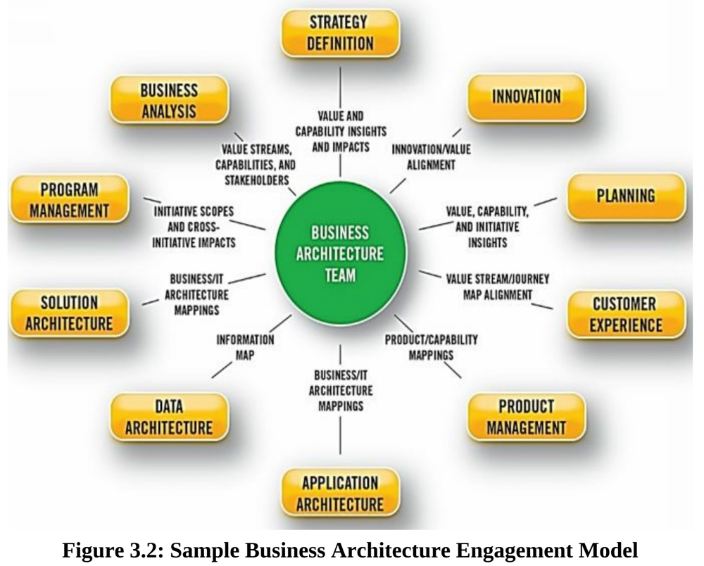
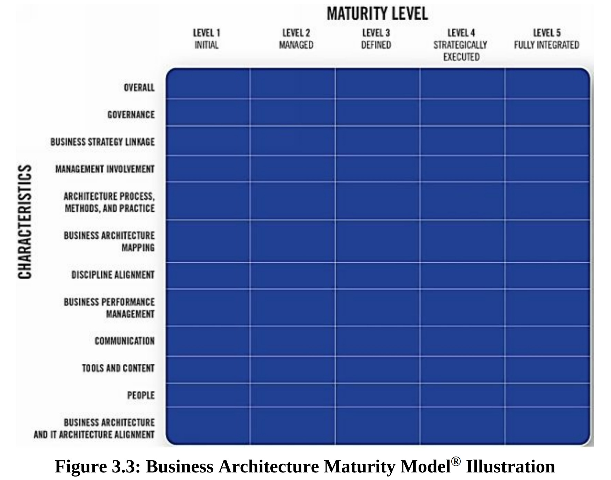
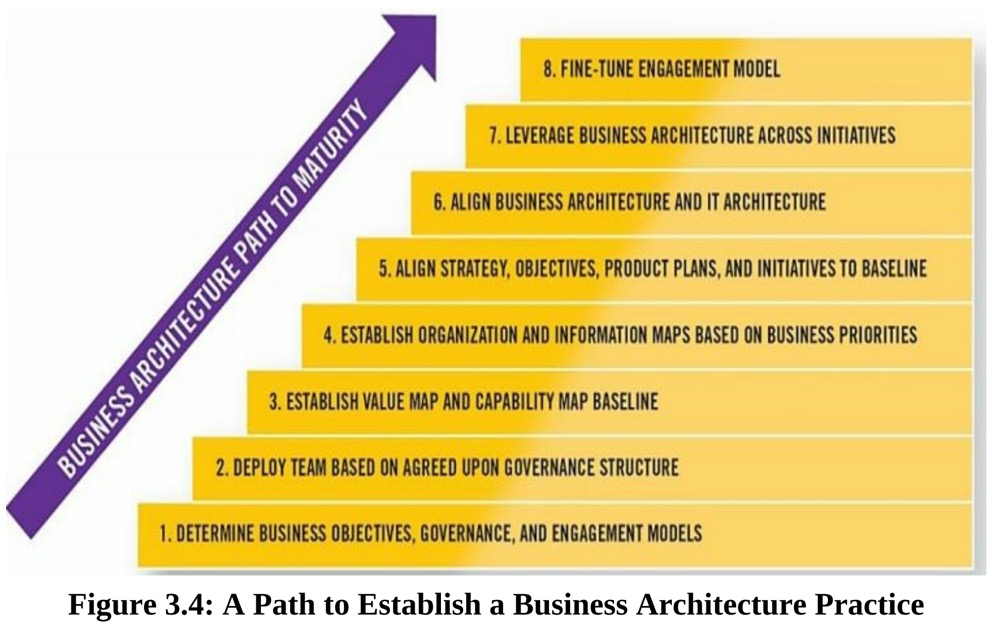

       一旦业务架构的效用和价值在一个组织内得到足够的重视，将业务架构确立为一种正式的实践是至关重要的。业务架构的实践包括一系列活动，如角色和团队的定义、从业人员的发展、组织的调整、社交化、治理过程和原则、方法和标准、工具管理以及整体路线图的定义。虽然业务架构知识库及其应用可能是焦点，但坚实的实践基础使实践能够随着业务架构完全嵌入到组织结构中的能力而扩展。一个实践同样可以作为赞助、资源和资金、治理、最佳实践、沟通和关系建设的焦点。本章讨论了如何引入业务架构，建立业务架构实践，定义业务架构师的角色，以及如何开始。

 ## 组织中引入业务架构

​        由于业务架构是一门相对较新的学科，在组织中引入业务架构可能需要一段时间和过程。例如，业务架构的主题并不是一个无处不在的会议室讨论话题，也不是一般大学课程的基础，甚至不是主流商业文献中的内容。因此，在每个组织的独特文化中引入这一概念需要时间来实现社交化。在一个特定的文化背景下构建业务架构和相关的利益是特别重要的，否则会阻碍人们对它的接受和相关的利益。

​       也许最难沟通的概念在于业务架构不是一个独立的学科；相反，它有助于使其他功能和学科更加有效。这一独特的特征使得业务架构的描述更加复杂，如果定位不正确，它可能被认为是一个竞争性的学科或多余的活动。业务架构还通过引入新的透明度水平和促进跨业务部门的协调和决策来挑战现状。文化和政治往往是成功的主要障碍，而不是业务架构提供的价值不足。

​       基于这些原因，在组织中引入业务架构是一个需要耐心、强有力的赞助、稳定的领导，以及注重与所有利益相关者建立关系和沟通的旅程。它可能还需要更多的时间和努力来证明这门学科的价值，然后才有足够的购买力来正式确定这一做法。

​        这方面的一个教训是，要避免大张旗鼓，而应该采取渐进式或隐蔽式的推广方法。这种做法并不意味着团队要对业务架构的范围和原则做出妥协。渐进式的推出方法已经表明，随着业务架构的各种要素的成熟，业务架构应被有选择地应用于有着接受业务架构的首众、同时具有高影响力的机会。下面的讨论为有效的推广业务架构提供了额外的见解。

##  建立业务架构实践的关键因素 

​        建立业务架构实践的方法不止一种。每个组织都是独特的，需要解决不同的切面来成功地将业务架构整合到组织中。然而，大多数组织将需要以下大部分（如果不是全部）要素来建立一个业务架构实践。

#### 定义业务架构的目标 

​        定义业务架构的总体目标是至关重要的第一步，但往往被忽视。如果从事这项工作的人和整个企业对目标不清楚，那么对这门学科的采用很可能会停滞。当建立目标时，某些问题的答案就不言而喻了。业务架构是专注于上游的战略制定、目标解释和举措框架，还是仅限于下游的举措解释和需求分析？目标是以业务为导向还是以IT为中心？业务架构的价值是孤立于单一业务部门或项目，还是为横向、跨业务部门的挑战和投资提供价值？

​        越来越多的组织将业务架构用于战略目的，以促进战略规划、执行优先权设定、客户价值提升、投资决策以及跨业务部门的横向解决方案部署。其他组织利用业务架构来满足更多的战术性业务需求，包括业务需求的创建和重用，数据和应用架构的定义，以及为业务流程团队提供洞察力，使他们能够集中精力并在各业务部门之间进行协调。重要的考虑是不要把业务架构框在一个有限的角色中。如果一开始就确立了战略视角，那么战术价值就会作为一个自然的副产品出现。

​         经过战略定位，成功的业务架构部署将为整个组织提供整体的业务价值，而不仅仅是为个别业务部门或举措带来局部价值提升。为了实现这一目标，必须有明确的、以目标为导向的业务架构目标，从而指导实践的方向，包括确定构建蓝图的优先级，制定和支持各种举措，以及组建团队，挑选团队成员。

​        无论某个企业是否关注其首要任务和相关目标，其重点都应与组织的顶层战略和优先事项对齐。相同的目标应该将其范围扩展到孤立的、战术的或范围受限的业务视角之外。例如，如果只为一个特定的项目建立业务架构，那么它将不会为该项目之外的相关项目或业务部门提供价值，同时一般也达不到预期的效果。简而言之，当业务架构在企业层面上被跨业务单元利用时，它是最有效的。

​        在设定目标时，请记住，业务架构能够解决各种各样的业务挑战。虽然这些挑战在不同的组织之间有很大的不同，但是高管们应该寻求利用业务架构来实现尽可能广泛的业务场景。以下是一个例子的清单：

- 解决合并、收购、剥离、精简或整合组织 
- 管理跨业务伙伴的产品和服务交付的整体视图 
- 在不同的业务单元或部门之间为风险管理和危机计划提供输入
- 从区域、产品或整个业务的角度对竞争对手的核心能力进行比较和评估 
- 对客户和其他利益相关者建立一个共同的、高度透明的视图，一些公司将此视为 "一个公司 "战略 
- 提高运营和执行信息的一致性和完整性 
- 评估监管或相关政策合规要求的影响和投入 
- 确认、收获并向客户提供改进的创新 

#### 沟通业务价值

​        一旦确定了业务架构的目标，最终取决于倡导业务架构的个人或团队来沟通其价值。制定一个有针对性的沟通计划需要时间、耐心和创造力，并且应该在制定之后持续沟通，逐步完善。业务架构的支持者永远不应假设每个业务部门、高管或关键利益相关者都清楚价值主张。沟通工作应被视为建立在行业和内部成功以及案例研究的基础上的持续信息传递活动。

​        要考虑的一件事是价值主张的主题。第 1 章指出，“业务架构作为一种有效的沟通和分析框架进而交付价值，可将战略转化为可操作的举措”。这个主题强化了业务架构本身是一个使能者而不是终结者的概念。第 1 章进一步指出，业务架构“增强了企业实施转型变革、驾驭复杂性、降低风险、做出更明智的决策、使不同的利益相关者与未来的共同愿景保持一致以及更有效地利用技术的能力”。重申这一信息为该学科的支持者提供了一个共同的参考框架。

​        除了保持一致的核心价值主张主题外，团队还应寻求系统性地为业务架构构建业务案例，以业务的优先事项和利益为目标。该案例可能包括记录突出的业务挑战以及业务架构可以提供的相应好处。还有越来越多的成功案例和案例研究[9]，团队可以根据需要加以利用。然而，关键是尽可能快地建立内部成功案例，即使是小的成功案例，因为这些案例使业务架构对业务主管来说是真实的。

​       例如，在业务架构的早期应用阶段，产品经理能够快速辨别出产品的生存能力有限，因为它与其他几个成功发布的产品共享一系列支持功能。没有理由继续进行产品概念化和设计工作，因为这种新产品会在公司的产品目录中造成冗余。此示例演示了如何使用业务架构来避免在产品生命周期的早期进行昂贵的投资。在另一种情况下，业务架构可能表明存在产品差距，从而为产品经理提供可靠的业务案例以继续推进。

​       无论哪种方式，业务架构都为在进入产品或项目生命周期的高成本构建和部署阶段之前停止或继续业务投资提供了早期洞察力。关键是内部成功以及行业案例研究可以帮助业务架构团队和支持者构建他们的业务案例，以建立可持续的业务架构实践。

​      最后，建立消息是沟通的一个方面，但传递消息是第二个关键部分。消息传播应利用团队可以使用的所有沟通技巧和媒介。选项可以包括网站、视频片段、推荐信以及其他最适合环境和文化的选项。

#### 评估利用业务架构的机会

​        尽早并经常展示业务架构的价值非常重要。对于新实践，使用双重方法，在构建业务架构基线的同时将其应用于可以利用它的机会。但是，在创建足够的基线之前，请注意不要过度使用业务架构。该建议至少包括一组生态系统范围内的高级功能，其中选定的功能分解为较低级别的细节，以及一组高优先级和（通常）面向外部的价值流。

​       任何应用业务架构的机会都应该集中在高可见度的计划上，尤其是那些跨越业务单元边界的工作。例如： 

- 利用价值流和能力来明确投资和举措计划的范围和重点

- 基于业务战略驱动的能力和价值改善来分析项目的业务价值 

- 使用业务架构术语和概念定位和传达业务优先级

  在评估机会时，时机就是一切。团队必须特别注意那些花费数月或更长时间构建业务架构基线的从业者，但他们几乎没有努力将其应用于一个或多个能产生价值的业务场景。相反，在没有建立基础业务架构的情况下，销售并被要求提供广泛的业务收益可能对实践造成同样或更大的损害。尽一切努力平衡推广的内容和可以交付的内容。

#### 建立业务架构治理结构 

​        合适和有效的治理对于确保业务架构的有效建立、利用、采用和可持续性至关重要。治理应尽早到位，并且必须以业务所有权、业务赞助和生态系统范围业务单位的代表为前提。图 3.1 描绘了业务架构团队的示例治理结构。在此示例中，团队或“卓越中心”向业务战略和转型团队报告，该团队本质上是一个高级执行委员会，负责制定政策、定义战略并确定业务问题和相关投资的优先级。该执行委员会提供了指导业务架构团队的行动和相关活动所必需的跨职能愿景。

​        图3.1强调了核心业务架构团队和虚拟团队参与者之间的关系。虚拟参与者来自每个业务部门（如左图所示）以及IT部门（如右图所示）。虚拟参与者在基于需求与核心团队的参与者接触，以建立和利用业务架构。核心团队的作用是管理业务架构的知识库、章程和路线图。当各种业务专业人士在实践中引入和应用业务架构时，核心团队也承担指导角色。

​       业务架构团队的最佳实践是作为一个卓越中心组织起来，并向企业报告。然而，每个组织必须选择最适合其目标和组织动态的结构。随着学科的发展，业务架构团队改变他们的报告路径或组织方式也是很常见的。另一个趋势是随着团队和相关角色的成熟，将团队从IT治理转移到业务领域治理。

​        业务架构团队面临的一个挑战和机遇是如何在一个已经存在其他学科的生态系统中系统性地调整业务架构。例如，业务架构必须证明它如何有利于客户体验、产品管理、组合管理、业务分析、解决方案和数据架构以及其他业务学科。图3.2所示的参与模型例子提供了一种互动和调整的通用方法。

​           图3.2是一个参与模式的图解，显示了业务架构团队、与之互动的相关团队，以及与每个团队的投入和产出或价值交换。这种图解式的观点通常由文字叙述和例子来支持。创建一个参与模型，将业务架构的作用框定在整个企业的其他既定团队和角色的范围内，并为整合活动提供一个基础。应对这一挑战的第一步是在生命周期的早期与其他团队合作，以建立、审查并根据参与模型中描述的互动采取行动。

## 建立业务架构基线 

​       "基线 "业务架构的概念根据计划的方案和相关目标而有所不同。一个推荐的做法是将能力地图的建立与对外的和高优先级的内部价值流相对应。否则，一般的建议是以能力地图作为业务架构的基础开始。然而，对于一个组织来说，很少有时间或倾向于在利用各种业务人员的能力地图之前，就完成梳理出完整的能力地图。因此，业务架构图团队应该把他们的能力分解工作集中在能在短期内为企业提供最大价值的能力子集上。许多企业把重点放在面向客户的能力上，如客户管理或账户管理。

​        虽然将能力映射作为第一步有很大的优势，但它不一定是起点。例如，组织映射提供了一个复杂的、区域性分布的业务视图，可以为业务架构的管理以及谁应该参与建设提供洞察力。价值流提供了一个业务友好的切入点，使业务专业人员和管理层参与到业务架构，并认识到业务架构的重要性，并且它们在确定利益相关者的焦点方面很有用，因为有助于识别首先应该建立哪些能力。信息映射是另一个开始，虽然以信息映射的形式参与业务，并作为最初的活动可能会产生更有限的结果。

## 在举措中利用业务架构 

​        组织希望尽快在制定的举措中开始使用业务架构。业务架构并不需要完全阐明到最细节的层级才有用。相反，部分阐述的业务架构可以用来宣贯和启动项目，并立即为企业提供价值。此外，将业务架构投入有助于确保举措的正确性和完整性。

​         例如，考虑到一个业务架构团队使用一套被分解成两到三层的核心能力来研究一个业务问题。该团队可能会发现能力映射的差距，即某些较低层次的能力还没有被阐明。当团队强调这些差距时，业务架构师可以利用团队的业务知识来进一步阐明能力地图。这种针对业务架构的 "运行场景 "的做法，通过在现实世界的场景中利用它来改善能力地图，从而为下一个团队或项目提供更强大的能力地图。价值流和其他业务架构领域的映射在使用过程中也得到了类似的完善。针对业务架构运行现实世界的场景，是使业务架构长期有效的理想方法，但要确保有一个强大的基础，包括一个明确的1级和2级能力地图，作为一个起点。

​        业务架构在举措管理上的应用包括举措定义和举措协调。举措的定义往往是对业务架构更高级的使用，因为它有助于根据价值流、利益相关者和能力影响来确定倡议和相关投资。然而，在业务架构团队实践生命周期的早期，根据共享能力、价值流和利益相关者的影响来确定举措的重叠是一个更常见的方法。举措的一致性分析使高管们能够直观地看到重叠和冲突的举措，进一步促使他们将业务架构的作用推向上游，以帮助简化举措的定义。

## 拓展业务架构实践 

​        一旦建立了基线业务架构，可能需要额外的工作或改进来拓展业务架构的广度或深度。这项工作通常涉及到对最初可能被推迟的业务能力进行更深入的分解，额外的组织映射，或对某些价值流进行细化。它还包括映射或扩展额外的领域，如产品、利益相关者、战略和倡举措。通过与其他学科的协调，业务架构也可能被映射到其他角度，如业务流程、需求和系统应用。

## 完善业务架构的治理和部署 

​        业务架构及其在组织中的作用将会而且应该会不断地发展。一旦业务架构的基础方面准备就位，各种业务蓝图的选择就可以为战略规划、组织调整、业务战略优先级以及从资本投资中获得最大价值的能力提供参考。随着时间的推移，使用业务架构的方案以及对业务架构的参与和信任程度将在深度和广度上得到扩展。一个达到业务架构完善阶段的组织已经走得很远，取得了很大的成就。

## 评估和提高业务架构的成熟度 

​        一个组织的业务架构实践越成熟，它能提供的价值就越大。业务架构成熟度模型®（BAMM®）是一个全行业的标准工具，用于帮助业务架构从业人员和主要利益相关者群体评估其组织在业务架构的部署和治理方面的成熟度、其在企业内的使用情况，以及其为企业带来的价值。BAMM®并不评估特定的业务能力的绩效或业务本身，而是特别关注业务架构实践的成熟度和相关结果。图3.3显示了BAMM®的概念性表示，为简单起见，一些类别被扩展到了一个较高的水平。

​        BAMM®对早期和成熟的业务架构实践非常有用，因为它为建立业务架构路线图和基于各领域的成熟度和整体实践目标的相关实践路线图提供了基础。业务架构协会® (Guild) 提供了一个可操作的BAMM®版本，可以进行业务架构实践的自我评估。

## 定义业务架构师的角色 

​        业务架构师是一个特殊的、非常受欢迎的角色，它结合了一套独特的硬技能和软技能。因此，业务架构师经常是在有了一些业务、IT或相关学科（如业务分析）的职业经验之后才进入这个角色。业务架构师的基本技能包括 ：

- 有能力超越传统的业务概念，并研究给定概念的核心 。
- 当传统的术语不能准确地描述业务的某一方面，有误导性，或不一致时，有能力自省地挑战它 。
- 沟通技巧，以创建和传播业务架构的演变和应用 。
- 适合于角色和被映射领域的业务主题领域的专业知识，对组织的整体业务模式有基本的了解 。
- 对业务架构蓝图的能力、组织、价值和信息映射的必要理解。以及在实践中理解和应用这些蓝图的能力。 
- 耐心合作，以确保业务架构反映业务，并帮助制定妥协方案，追求建立整体业务生态系统的观点。 
- 相关学科的知识，包括战略规划、产品管理、组合或项目管理、业务分析。勇于挑战传统的专业术语，以创造清晰的框架，实现业务目标，为利益相关者提供价值。 
- 能够与各种利益相关者合作，包括业务主管和中层管理人员，以及业务分析师和IT架构师。

​      业务架构师不是一个单一的角色，需要具备多维度的技能，通常由不同水平的业务架构师来完成。例如，能够从业务架构的角度熟练地制定目标、产品计划和举措的能力和价值映射专家，他们可能与高管接触以将业务架构应用于各种业务场景的业务架构师不是同一个人。同样地，不同的人可能会根据业务知识与不同的业务单元接触，而不是与IT架构师一起工作。因此，卓越的业务架构中心通常代表一个团队，作为一个集体来履行这些角色。

​        从业人员应该注意到，这个行业已经成熟到可以从协会获得CBA®专业认证。获得并持有CBA®认证正成为企业寻求业务架构职位的一个基本要求。CBA®项目将继续发展，因为协会将发展考试以反映最佳实践，并将更多级别纳入该项目。

## 入门指引：建立一个成功的路线图

​      确定从哪里开始业务架构的实践可能会让人不知所措。团队成员应该从学习实践业务架构的这一学科开始，这样实践就可以被有效地定位--这是任何实施工作的一个关键成功因素。除了这个基本要求，图3.4还强调了建立和发展业务架构实践的路径。这条路径建立了一个基础性的治理结构，并从这一点上发展了业务架构及其应用。

- 步骤1： 明确定义实践的总体目标、治理结构和参与模式是建立业务架构实践的基础。一旦具备启动条件，就可以建立基本的治理基础，其中包括业务架构团队章程、角色定义、团队结构、参与模式，以及建立和成熟实践的路线图。

- 步骤2：建立团队结构是基础。

- 步骤3：建立一个业务架构基线，包括一个正式的能力地图和相关的价值流集合。

- 步骤4：团队有选择地开发组织和信息地图，以适应实践的需求。

- 步骤5：团队可以有选择地确定业务架构的早期最佳部署方案。例如，有些团队专注于战略映射，部分团队可以负责产品规划，而其他团队则通过参与项目和组合管理来专注于举措规划。这里的关键点是要关注企业的高价值、高回报的机会。

- 步骤6：涉及到IT架构的对齐，引入企业、数据、应用和解决方案架构师的需求，以实现各种影响评估、规划和部署相关的目标。

- 步骤7：跨举措使用。

- 步骤8: 持续改进参与模型。

  虽然这条路径反映了一个打积木的方式，但许多组织已经同时启动了该路径的多个方面。当然，一个特定的卓越中心可以按照自己的节奏自由发展，但从业者要注意不要跳过各个层次，因为这可能导致实践的不稳定。例如，在没有强大的价值流和能力基线的情况下进入第5-7步，将导致在没有基础的情况下尝试实践业务架构，从而危及实践的可行性和团队的完整性。同样，在缺少或没有治理结构的情况下，开展步骤3-4中广泛的业务架构映射工作，从长期来看是不可持续的。

​        一个卓越的中心会希望建立路线图正式确定里程碑，并将资源集中在正确的任务上。两个路线图类别构成了一个组织中规划和交付业务架构的基础。第一类是**业务架构路线图**，它代表了业务架构本身的演变，包括业务架构的所有核心和扩展领域以及关系。第二类路线图是**业务架构实践路线图**，它代表了本文所定义的实践的成熟度以及它在企业内的相关影响。这些路线图是由组织的整体业务架构目标以及成熟度模型或BAMM®提供的，它提供了对目标成熟度水平的洞察力。 

## 常见的入门误区 

​      多年来，当企业寻求启动和开发业务架构实践时，常见的误区往往会浮现出来。其中许多错误的做法是由于管理层试图将传统的工具或技术推广实践应用于业务架构，而管理层往往误解了这门企业业务学科。这些错误的做法包括：

- 将业务架构的范围限制在一个单一的业务单元，而对具有共享能力、客户、价值流、信息和业务目标的相关业务单元没有可见性。 

- 试图在一个单一的问题、系统或类似的范围有限的主题上进行狭义的概念验证，这不需要也不会以有意义的方式证明业务架构的价值。

- 在一个不稳定的、阐述不明的、或范围受限的能力地图和价值流的情况下，启动广泛的、高可见度的使用场景（如图3的5-7层级）。

- 将能力的阐述范围限制在一个单一的业务单元，使得业务架构不仅是跨业务单元，而且很可能是在该单一业务单元的范围内都无法使用。

  建立一个业务架构实践是一段需要时间的旅程，但本章中描述的最佳实践将帮助团队避免常见的错误步骤，增加他们成功的机会。BAMM®为评估和规划如何使业务架构实践成熟提供了一个重要的基础，它在实践路线图中正式确定了目标成熟度的里程碑。随着这些里程碑的实现和实践的成熟，业务架构所提供的价值将随着时间的推移而相应增加，它作为商业战略和变革的重要推动者的声誉也将随之提高。

