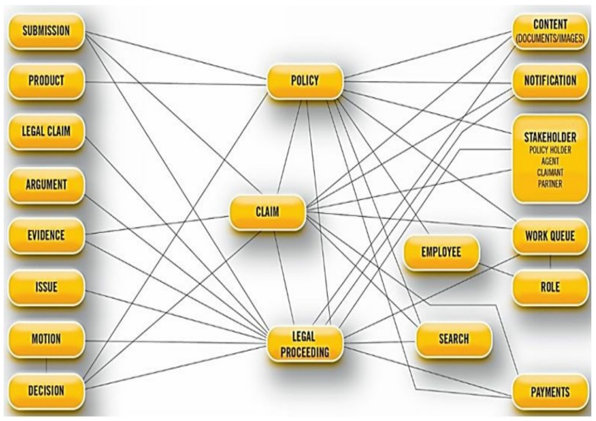
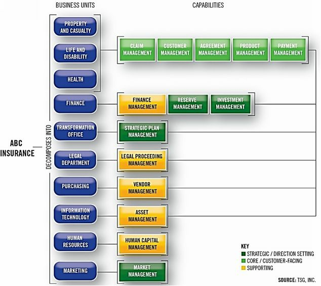

        为了有效地利用业务架构，必须为管理层、从业人员、受益者和其他感兴趣的人用非常具体的术语来定义这门学科。正如第一章所介绍的，业务架构是由一组核心业务领域（能力、价值流、信息和组织）组成的。这些核心领域构成了阐述和利用业务架构的基础。如果没有这个坚实的基础，就会降低一个组织在众多的业务场景和计划中成功建立和利用业务架构的可能性。本章定义了这些核心领域，讨论了它们如何发展，分享了最佳实践，并概述了这些领域在实践中的作用。

## 能力

​        能力是业务架构中最广为人知的领域，但通常被误解。虽然能力一词可以有多种解释，但业务架构有一个标准的定义，它为映射和利用各种情况下的能力奠定了基础。一种能力被定义为 "企业为实现特定的目的或结果而可能拥有或交换的一种特殊能力"[11]。这方面是能力与其他业务方面（如业务流程）的一个主要区别。

​       另一个区别是，就能力所代表的业务内容而言，它并不是一种期望。虽然有一个未来状态能力的概念，但这些能力往往是分散的，通常是由一个组织的业务模式的实质性转变所引发的。能力的实现有多种方式，可能不是自动化的。手动的能力仍然是一种能力，将一种能力自动化并不改变它的存在、定义或业务背景。

​        能力代表了企业的基本构建块，或称DNA。它们被分析、改进、增加，最重要的是，被利用来实现各种各样的业务目标。当定义正确时，能力构成了一个业务架构的强大核心。相反，如果能力的定义松散或多余，缺乏严格的定义或界限，那么整个业务架构就会被削弱，并且不太可能提供预期的价值。

​        在一个正式的业务架构中有效地阐述能力需要遵循一套简单的原则。BIZBOK®指南为能力定义了一些原则和准则。这些原则和准则可以总结为几个简单的要点，包括： 

-  能力定义了企业做什么，而不是怎么做，这意味着能力提供了一个强大的、长期存在的业务观点。 

- 能力代表了独特的、非冗余的业务观点，这些观点对企业来说只需定义一次 。

- 能力基于业务对象，它创造了简洁、明确、清晰的业务观点。

- 能力不是由一个特定的项目或业务单元随意或按需定义的，但它们确实代表了一个基础的、跨项目和业务单元的普遍的业务观点。

- 企业将为其业务生态系统拥有一个能力地图。

  能力地图将众多能力组织为一个视图。能力是通过应用分级结构来定义的，第1级能力位于顶部，随后的级别定义了更加细化程度。定义在第1级以下的能力有且只有一个父级，确保为能力划出清晰的界限，同时避免冗余。考虑一下图4.1所示的1级能力地图例子，每个方框代表1级能力（例如，业务计划管理、协议管理、人力资本管理、培训管理、合作伙伴管理）。 每个能力都基于一个简明的业务对象（写成名词），代表业务的一个具体方面，并有明确的定义。

​									**Figure 4.1: Sample Level 1 Capability Map** 

​        图4.1所示的1级能力采用了传统的三层结构，将能力分为战略、核心或面向客户、以及支持。这种分层映射结构为定义投资和举措的优先级提供了洞察力。这种分类方案有助于围绕企业的核心能力与方向设定或支持性的观点来构建企业的思维方式。支持层代表了大多数企业的共同能力；但是，它可以因商业模式和行业而有所不同。例如，一个制造业、采矿业、公用事业或运输公司通常会将资产管理放在核心/面向客户的层级，而不是支持层级，因为它是其业务的核心。这种设置与保险公司相反，在保险公司中，资产管理只是一种支持性能力。

​     能力地图的范围直接与业务生态系统的范围相关联。如果忽略了这种关系，那么能力地图的使用就会受到人为的限制，这意味着能力地图只在狭窄的、可能是短期的范围内有价值。为了有效地设定范围，1级能力必须最低限度地覆盖能力地图所要使用的生态系统的范围。经验表明，对筒仓式的、定义不明确的、或其他考虑不周的能力地图进行改造，比一开始就建立一个基于原则的、范围合适的能力地图要难得多。

​       能力地图需要时间来发展，但在完全阐明之前就可以利用。例如，被分解到第3级的特定能力，作为战略规划讨论的输入是有用的。然而，端到端的转型需要更细化的分解。对于刚刚起步的组织，映射团队应该建立适当的1级能力范围，然后根据近期的投资重点来阐述和分解能力。

​       能力地图本身并没有设定背景，也就是说，能力地图并没有阐明利益相关者的价值、业务部门、产品、自动化或其他观点。这个规则是设计出来的。一个明确的业务架构将能力与它们所能实现的价值流、涉及的业务单元、需要的产品以及使它们自动化的技术联系起来。通过将能力与业务架构的核心和扩展领域的交叉部分联系起来，可以提供背景。

​       业务背景促进了业务架构的价值主张，同时允许能力作为强大的基础。例如，当能力与价值流匹配时，企业很容易设计出需要哪些能力来实现客户、合作伙伴或内部利益相关者在各种情况下的价值交付。然后，可以在一个或多个利益相关者、价值流和相关观点的背景下聚焦特定能力的投资。在任何时候，企业都不应该试图将使用环境贯穿到能力地图中，因为这将限制整个能力的使用。

​      为利用业务架构提供使用背景，有利于业务架构的采用。最佳实践建议让能力地图在后台，利用价值流、利益相关者、产品和其他背景作为能力优先级和投资的一个窗口。例如，使用价值流来引导业务团队完成一个业务场景，比单独的使用能力地图更有效地落地。请注意，在特定价值流、业务单元、技术自动化或产品的背景下显示的能力被称为 **"能力实例"**，这是一个用于评估背景下能力的术语。[12] 

​       除了将能力与价值交付联系起来，在实践中利用能力的业务单元、技术和产品还依赖于衍生出某些绩效分析。最常见的分析方法是热力图，根据能力的有效性，将能力用颜色编码为红色、橙色、黄色或绿色。能力热图可以表示为度量，以及其他绩效分析，包括影响等级、自动化水平和覆盖范围的广度。例如，一个协议风险确定能力可能得分很低，被能力热图显示为红色。同样的能力可能被打分为影响大、自动化程度有限、覆盖面广，这表明高管们应该投资于提高企业评估协议相关风险的能力。第6章对业务绩效管理进行了更深入的处理。

​       企业应该牢记，能力地图必须超越项目、重组和业务模式的转变。如果不是这样，那么整个业务架构的范围和价值就会受到限制。刚开始建立或计划改造现有能力地图的组织，应该寻求建立一个能够实现多样化、复杂和大规模的业务场景、转型工作以及跨越多个业务单元和项目的相关举措的地图。遵循基本的映射原则将确保建立一个强大的能力，作为未来几年的业务架构基线。

## 价值流

​         价值一般指某物的重要性、价值或有用性，它是一个组织的根本。因为一个组织存在的唯一原因就是为一个或多个利益相关者提供价值。通过从组织的关键利益相关者（尤其是客户）的角度关注价值最大化，组织就有可能从 "由外而内 "的角度来看待自己，而不是从通常主导流程改进计划的、更注重操作的 "由内而外 "的角度来看待自己。

​        在过去，有几种方法被用来建模、度量和分析业务价值。三个著名的技术包括价值链、价值网络和精益价值流。每种方法都有一个独特的目的和重点领域，使其与其他方法的定位不同--也与本快速指南的主题--业务架构 "价值流 "不同。价值链从经济价值的角度出发；价值网络主要关注参与创造和交付价值的参与者；而精益价值流则专注于优化业务流程。

​      只有业务架构的价值流是为了从客户的角度（或更普遍的利益相关者的角度）创造一个端到端的价值视角，并且，在这样做的时候，更接近于实现一个组织的商业模式，而不是提供专注于运营模式的效率改进。

​       业务架构基于价值流的价值分析方法来自于James Martin的 "伟大的转变"[13]。价值流的例子见图4.2，它被描述为一个端到端的增值活动的集合，为客户、合作伙伴或其他利益相关者创造一个整体结果。在价值流中表现价值的主要方式涉及两个重要的概念：价值条目（价值增量）和价值主张。这些概念提供了明确的信息，例如，在一个特定的环境中，客户希望得到什么，这表现为一个价值主张，以及在实现这一结果的过程中的标记，这表现为一个价值条目。

​										**Figure 4.2: Example of a Value Stream and Value Stream Stages** 

​        在图4.2的背景下考虑价值主张和价值条目，该图描述了一个顾客通过航空公司进行的旅行。右边显示的价值主张是顾客到达他们的最终目的地。中间实现的价值条目包括计划旅行、获得机票、准备、启程、到达目的地、以及结束旅行。这个价值流代表了整个旅程，其中可能包括客户在多段旅程中多次停留，沿途参与各种活动，并最终到达最终目的地，从而结束旅程。与客户旅程相关的每个事件和相关行动都体现在这个价值流中。

​        增值活动由价值流阶段表示，当价值流从一个阶段过渡到下一个阶段时，每个阶段都会创造和增加增量的价值条目。价值流阶段代表着明确定义的阶段门径，有明确的入口和出口标准，参与的利益相关者，和价值条目。利益相关者可以包括内部参与者，如登机检查或预订代表；或者外部参与者，如安全代理机构。

​        价值流可以由外部触发（例如，零售客户获得商品），内部触发（例如，经理获得一个新员工），或由两者触发（例如，合作伙伴或内部利益相关者可以发起修改协议条款）。价值流，像能力一样，代表了整个生态系统的观点。例如，一个单一的价值流体现了一个金融机构的账户设置，而不考虑账户的类型或所涉及的业务部门。一个组织的主要业务活动的价值流集合，则代表了一个企业协调其能力为其外部和内部利益相关者创造价值的多种方式的集合。

​       为了充分理解价值流，查看两个同时运行的价值流实例是有帮助的，其中某些事件受到同一业务对象的共享实例的状态变化的影响。图4.3显示了两个价值流：旅行和飞行路线。旅行表示客户在旅程中转换的事件。飞行路线关注的是在飞行环境下飞行一条或多条给定路线的飞机，其关注的是飞机在该路线上的过渡事件。客户被匹配到一架飞机和一趟航班，这反过来又使客户对象改变状态，反映在 旅行价值流中。

​												**Figure 4.3: Dual Value Streams** **Concurrently Sharing Common Business Objects** 

​       从业务架构的角度来考虑这个相同的旅行场景。飞行路线价值流中的两个关键业务对象：飞机和航班，会影响旅行价值流中的事件。在旅行价值流中的一个客户，与通过飞行路线价值流的航班和飞机相匹配，其状态将被航班和飞机所改变。如果该飞机被撤消，航班被取消，客户将被匹配到一个替代的飞机和航班。

​        这些相同的价值流框定了飞机和航班与机场的匹配，食物与飞机的匹配，燃料与飞机的匹配，机组人员与飞机的匹配，等等，这些都是通过价值流独特地框定的。价值流只是框定了被 "交叉映射 "到价值流阶段的使能能力，以完成繁重的工作。这个旅行场景只是一个例子，说明基于定义的能力、相关的业务对象和价值流是如何建立一个基础性的视角来设想企业如何运作，优化业务目标的影响点，以及解决这些目标的创新解决方案。

​        价值流，就像能力一样，可以在价值流阶段层面上进行热图绘制。在这个意义上，价值流阶段热力图与能力热力图的方法类似，需要评估价值流阶段的表现，并反映表现的评级。当一个价值流阶段显示为红色时，可能有很多原因，但最常见的是，原因是对该阶段对应的能力开发或部署不足，也可能是完全缺乏某些能力。

​        价值流实际上是能力的平衡点。能力是指企业所做的事情，并通过定义良好的业务对象的界限来框定能力范围，而价值流的重点是通过这些能力的有效结合，为利益相关者提供价值的行动框架。价值流与能力有着内在的关系。它们共同构成了一个强大的分析工具，用来解读企业的构成部分，以更好地了解其内部运作，评估组织的使命和为支持该使命而开展的活动之间的一致程度，并确定存在改进机会的地方。

## 信息

​        准确、及时和相关的信息对于企业做出有效决策、制定和部署可操作的战略以及确保有效治理的能力至关重要。信息对于由知识型员工驱动的经济，以及企业在鼓励和激励智力冒险的文化中进行创新的能力至关重要。最重要的是，信息必须在需要的时间和地点提供，以确保一个企业的生存和成功。企业必须确保他们已经建立了管理整个商业生态系统的准确和及时信息的基础。

​       企业在获取、解释、转换、传播、管理信息方面花费了大量资金。然而，这些信息的及时性和准确性并不总是能满足客户、合作伙伴、管理人员和其他利益相关者的直接需求。这些限制往往在需要的时候才浮现出来，但往往是源于基本概念、术语和关键信息定义的根本错位。例如，考虑到横跨多个行业的众多公司难以识别与特定客户相关的所有账户、政策或协议。这些挑战是一个商业生态系统失调的症状。

​        信息是通常提到的数据、信息、知识和智慧（DIKW）金字塔的一个组成部分，如图4.4所示。[14]该金字塔强调了当业务环境需要应用数据时建立的基础，数据是通常由自动化系统管理，它构成了衍生信息的基础。信息是衍生出更高层次的知识和智慧的基础。因此，有效的信息管理对于持续地将数据转化为作为战略规划和决策基础的知识和智慧是必不可少的。

​													**Figure 4.4: The Data Information Knowledge Wisdom Pyramid** 

​         企业利用信息映射来汇集多种业务视角，改善战略规划和相关的投资计划，增加业务部门之间的协作和沟通，并改善客户价值的交付。信息映射使术语、定义和关联在基本的业务层面保持一致。当信息与能力对齐时，业务架构建立了一个清晰、明确的观点，即企业做什么以及做这些事所需的信息。然后，这种业务观点被用来构建相关的IT架构，以确保技术部署反映业务的实际情况。

​        业务架构在信息概念的背景下框定信息，信息概念描述术语、定义、关系、类型、使用和消费信息的业务观点。业务架构方法使用信息概念有意避免了技术参考或数据管理的限制；该方法在为业务生态系统定义的业务能力的基础上建立一个通用词汇表。

​        一个信息概念被定义为在业务架构的背景下表示业务术语和语义的一种方式。简单地说，每个信息概念是对企业所关注的对象的整体或部分的表示。信息概念可以有如下三种类型：

1. **领域**概念来自于业务对象，如协议、人力资源、客户、地点、产品或资产。这些从对象衍生出来的类别通常是企业定义的第一个信息概念，并且经常被分解或细化为更详细的信息概念，如一个协议术语。
2. **关系**代表对象派生信息概念之间的关联。例如：信息被要求代表一个客户和一个协议的联系时建立的关系。
3. **可区分的业务对象**是代表一个信息概念的具体实例。这些实例可以被识别出来，例如，利益相关者类型或角色的业务对象，包含承销商或信贷局。

​         一旦建立了信息地图，它就可以被企业的其他领域所使用。信息地图强调了信息与其他业务要素交叉映射的价值，包括能力、利益相关者、组织和举措。将信息与其他元素结合在一起，这些交叉映射扩展了信息定义的价值，例如，显示出某些信息在哪里被要求或被能力所修改。这些交叉映射反过来又促进下游活动，如数据管理、应用设计和商业分析。业务架构相关的信息原则和准则总结如下：

- 信息是一种战略性的商业资产；由企业拥有和定义，不受技术或数据管理的限制 

- 信息概念来自于业务能力并与之保持联系 

- 共同的业务词汇简化了协作、沟通和自动化 

- 信息访问受到安全、保密和隐私政策的限制 

  ​         图4.5显示了一个信息地图样本。注意方框中的信息概念，用线条描述了其中的关系，其中一些随后可能被演化成独特的信息概念。另外，注意利益相关者框中的四种信息概念；每一种都成为独特的信息概念，可能需要独特的信息。

​				**Figure 4.5: A Sample Information Map  with Information Concepts, Types, and Relationships**

​          图4.5中的每个信息概念都突出了一个独特的业务对象，用于描述业务术语。有了一致的业务对象，流程自动化、应用开发和业务分析的从业人员就有了一个基础，用于相关的投资和项目，从而以一种可靠的方式在业务和技术学科之间运作并调整结果。与能力地图一样，信息地图可以被扩展，随着时间的推移而演变，并根据需要分解到更低的层次。

​        业务驱动的信息定义是一个基础，应该在数据治理、应用开发和业务分析等工作之前设置，这样团队可以缩短他们的准备时间，最大限度地减少风险和混乱，并提高业务举措的准确性。

## 组织

​        组织代表了四个核心业务架构领域之一。组织结构映射与能力、价值和信息一起构成了一个强大的、相对完整的业务视角。组织地图描述了业务单元、组织分解和相关的组织导向关系。例如，一个银行有一个消费者贷款部门，其中包含一个贷款部门，这就存在一种分解关系。在适当的时候，扩展的组织地图会纳入业务的其他方面。

​         将组织观点纳入业务架构为企业提供了巨大的好处。它为问题分析、计划和解决方案的部署提供了组织背景；改善了战略规划和投资分析；挖掘了改善协作和沟通的机会；最后，填补了层次结构图中的 "空白"。[15] 

​       最后一点很有意义，因为传统的层次结构图还没有被整合到业务架构中，而组织映射为业务架构提供了一个结构性的视角或过滤器。例如，当与能力相联系时，围绕着哪些业务单元拥有某些能力而建立了清晰的概念。关于如何最好地表现组织，有无数的变化，没有单一的方法来完成这项任务，这意味着像业务架构的其他方面一样是由原则驱动的。

​     原则和指导方针的摘要包括：

- 组织地图的范围是业务生态系统的范围，在其核心处有一个单一的企业焦点。
-  组织地图利用已建立的业务单位的名称，使其容易被企业识别。 
- 在适用的情况下，组织结构图的关系包括业务单位的分解，能力到业务单位的表示，以及业务单位到协作团队和业务伙伴的关系。
- 组织地图反映当前和准确的业务。

​        基本的组织地图是通过对整个企业的业务单元和业务单元分解的检查和记录建立起来的。图4.6描述了ABC保险公司的此类地图的一个例子。该公司是地图上的焦点企业。该企业被分解为业务单元。组织地图在第一层描述了业务单元，以及与每个业务单元相关的能力。    

​        图4.6展示了一些简单的关系，这些关系可能被理解，但在整个业务生态系统中从未被清楚地阐述过*。这家公司有四个业务单元拥有共享的能力。这种设置并不罕见，但规划、风险管理和其他团队可能会考虑部署客户管理能力的四个实例，广泛部署的能力实例可能会增加这些观点被高度孤立、冗余和分散的可能性，可能会造成潜在的风险领域。*

​								**Figure 4.6: Organization Map with Capability Relationships**

​       组织地图为业务架构提供了一个重要的基础性组成部分。能力和价值地图揭示了业务的本质，而组织地图说明了拥有这些能力并参与这些价值地图的内部业务单元或第三方。具有复杂的业务结构、多个部门和多地区部署的组织是建立组织地图的首选。这种类型的映射提供了真正的价值，同时验证业务生态系统的范围，可以作为规划、项目集定义和投资的输入。

## 验证业务架构 

​        检验业务架构是否正确和相对全面的最好方法是通过它 "**运行场景**"，然后对它进行相应的改进。例如，一家制造公司有三个基于协议、账户和订单的一级能力。不清楚的是，一个订单是否可以针对账户（与个人或公司客户相关的唯一标识符）、针对协议、或针对账户和协议发出。与市场营销、产品团队、车队团队、售后团队和其他业务领域一起制定了大量的微观方案。

​        在执行了大约十几个场景后，出现了明确的迹象，表明订单总是服从于协议，账户和协议以不同的方式根据部门、客户和业务模式进行匹配。由此产生的变化使订单管理成为协议管理下的第二级能力，这意味着订单可以存在，而且只在协议的背景下存在。这一改进是很重要的，因为将订单管理作为一个一级能力，会造成映射的模糊性，而能力地图是专门用来解决这个问题的。

## 构建基础性的业务架构 

​       共同建立业务架构的核心领域和这些领域之间的关系，为企业提供了在一系列业务场景中利用该学科所需的基础。最佳实践表明，以并行、协调的方式发展一个能力地图和优先价值流，是一个良好的开端。信息映射是一个相关的优先事项，提供一个关于如何通过自动化和非自动化手段管理信息的业务视角。然后，组织地图为业务部门和业务伙伴提供了支持横向规划、投资分析和项目定义所需的观点。

​      一旦业务架构基线到位，战略规划师、客户体验团队、产品管理、投资组合经理、业务分析师、IT架构师和其他业务专家就可以开始利用业务架构。第5章和第6章将从战略规划到解决方案部署来探讨这些扩展的观点。