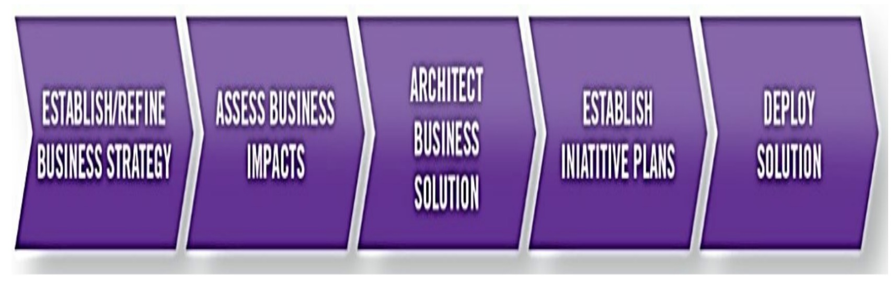
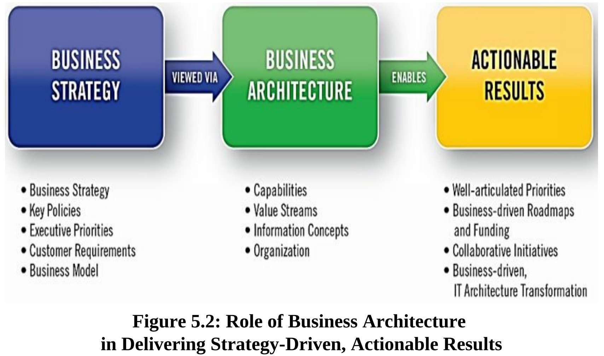
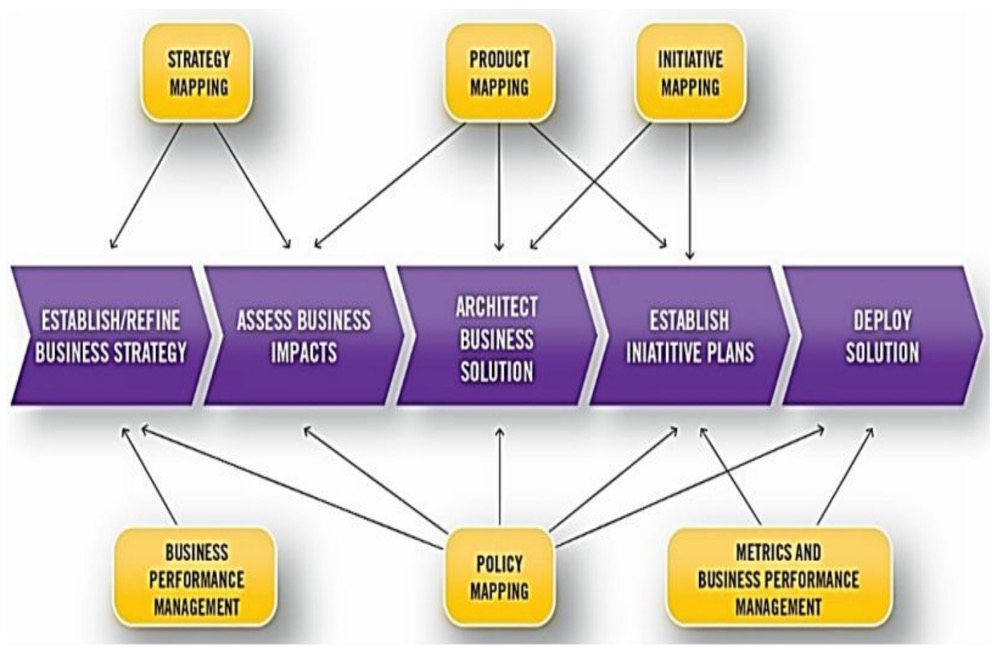

​       业务架构的主要好处之一是在业务战略和执行之间建立一个直接的联系。虽然 "战略到执行 "的概念已经成为一个热门词汇，但业务架构是一种有效的方法，可以利用图5.1所示的业务架构价值流来实现转型的业务战略。

​										**Figure 5.1: The Business Architecture Value Stream** 

​        图5.1中的五个价值流阶段将利益相关者从创建业务战略的起点--与业务领导者和战略者合作--通过影响评估、解决方案架构、举措框架，以及最终以物理（或虚拟）解决方案的形式交付业务价值。业务架构从业人员促进、使能、支持和领导这种价值交付方式的各个方面，如以下各节所述。

​       在研究业务架构如何提供价值之前，有必要回顾一下在整个价值交付过程中建立、评估和更新的业务架构的核心和扩展领域。图5.1中描述的每个价值流阶段都需要维护核心领域--能力、价值流、组织和信息，以及扩展领域--商业模式、政策、产品、利益相关者、指标等。

## 建立/定义业务战略 

​        业务架构本身并不创造业务战略。这个责任是企业的职责。然而，业务架构从业人员可以为战略发展过程提供信息并带来一种结构化的方法，从而增加整体的成功机会。图5.2显示了业务战略是如何通过业务架构来阐述的，这最终导致了可执行的部署计划。

​      在第一步中，业务架构从业人员帮助提供信息，制定和调整战略计划。战略计划通常由可衡量的目标和相关的行动项目、政策、优先事项和商业模式变更等组成。具体如下：

- 商业模式规定了创造、交付和获取价值的一致方法。

- 战略计划定义了组织的愿景和使命、目的和目标，以及要采取的相关行动。

- 政策从合规的角度进一步明确和约束战略计划。

​        战略计划为商业模式提供信息，反之亦然。业务架构师可能需要在促进这两份文件的发展方面发挥作用，这取决于组织对相对正式的战略规划方法的偏好和能力。至少，业务架构应该为战略定义和相关的优先事项提供信息，特别是当涉及到第6章中讨论的业务绩效分析时。为了有效地确定要采取的具体行动，必须充分阐明所期望的未来状态，以便能够准确地确定业务影响，正如通过业务架构的视角所构建和沟通的那样。

## 评估业务影响 

​        很多时候，战略计划是在行政会议室、领导务虚会或业务规划会议上制定的，而没有充分考虑到一个具体的战略会如何影响业务，如何实施，或如何影响团队和组织资源。业务架构可以帮助沟通和提升对战略的理解，这对制定战略的高管和负责实施新业务举措的人都有好处。

​        业务架构从业人员可以通过进行客观的业务影响分析来帮助建立一个参考框架。这项活动涉及到评估每个业务战略、目标和目的的影响、权衡以及实施它们所需的活动。业务架构从业人员与业务领导者、规划人员、组合领导者和其他主题专家合作，制定影响分析，解释战略、目标或目的是如何作用于业务能力、价值流、信息资产、组织结构等，完善实现战略所需的行动项目，以及业务架构的当前状态。

​         虽然这主要是一个以业务为中心的活动，但这也是业务架构开始与企业架构和更大的技术组织建立伙伴关系的地方。在这个阶段，有一部分时间涉及到了解这些战略如何影响技术、应用和信息架构。当务之急是从业务架构开始，建立以业务为中心的视角来进行分析。

​        这个阶段的交付物包括对战略效果的现状评估。具体来说，业务架构团队在核心业务架构领域方面沟通业务目标和相关行动项目的影响。例如，一组给定的业务目标的影响可以被阐述如下：

- 首先，基于在早期所了解的客户偏好需求，业务架构从业人员将把目标锁定在与一个有缺陷的产品价值流相关的限制上，反过来，这将是使目标被重新设计或相关转化。 

- 其次，使用价值流影响分析作为基线，业务架构从业人员将锁定表现不佳或缺失的业务能力，这是上述客户价值交付限制的根本原因。

- 然后，能力将为规划团队指出与表现不佳的业务能力相关的流程、人员、信息和/或自动化限制，反过来，这些限制将成为改进的目标。

- 最后，业务架构根据能力和价值流的影响，突出业务单元的范围，帮助确定业务目标的范围、相关的行动项目和相应的投资。 

  

  在下一个阶段，架构业务解决方案，业务架构从业人员将定义业务的未来状态，描绘出业务实现其战略和目标后的愿景。虽然这些阶段是按顺序排列的，但当前状态和未来状态的可交付物可以同时产生或呈现。

## 架构业务解决方案

​        在建立未来状态的愿景过程中，业务架构的价值变得更加明显。在前两个阶段，即建立/定义业务战略和评估业务影响，业务架构从业人员增加并澄清了大多数企业的共同活动。但往往缺少对战略最终将导致的愿景的描述，即企业将成为什么。在架构一个业务解决方案时，业务架构将成为确定实现预期目标要求的基础。

​         明确企业能力和价值主张的未来状态，对于实现提议的业务解决方案至关重要。例如，热力图中评价较差的能力可能需要改进，导致业务关键性冗余和不一致的能力实例的数量可能需要调整，或者需要引入新的能力。业务架构师需要与交付团队、案例经理、流程设计师和技术专业人员合作，以构思最终的业务。

​        在这个阶段，需要设计、审核和最终确定业务解决方案。这项工作需要确定目标状态的各种解决方案，确定实现战略和目标所需的变化量，规划和协调工作成效，并最终确定企业可用于满足其未来需求的选项。通常情况下，有多种方法可以实现一个业务战略；业务架构从业人员与其他业务和IT专业人士一起，必须开发一套方案，以提交给业务领导者，然后由他们来评估一系列的解决方案。幸运的是，业务/IT架构的影响评估可以在前期进行，即在举措定义之前进行，这一点在第6章有进一步的讨论。 

## 建立举措计划 

​        解决方案评估规划团队将有选择地评估和阐明业务和IT架构的影响、组织变化、业务设计更新、流程变化、高层次要求和整体转型方法，包括满足战略目标的选择。然后，业务架构从业人员可以与组合管理、IT领导和架构师以及其他业务规划人员合作，建立企业实现其战略的方式。

​       举措计划有很多形式，包括项目、主题、史诗、投资等等。无论采用哪种方法或方式，业务架构师都可以帮助明确实施的方向、投资以及实现战略的计划。这个阶段的关键因素是，业务架构根据对业务的同时、相关或互补的影响，特别是共享价值流和能力的角度，来框定倡议和相关投资。在这一阶段，业务架构从业人员在业务架构的背景下，通过并框定几个角度，包括：

- 举措的定义，它定义了将解决优先业务目标的工作努力 
- 目标映射，它确定了将导致业务的可操作目标的工作努力 
- 衡量标准，它强调了如何衡量每个机会的成功 
- 权衡、决策和成本/效益分析，强调了哪些倡议最适合及时实现业务目标 
- 举措映射，详细说明计划和正在进行的项目的跨举措影响，使用业务架构作为框架，叠加工作努力的潜在影响或冲突

## 部署解决方案 

​        随着计划中的工作走向部署，业务架构从业人员转变为咨询角色。现在的重点是在解决方案的部署上与团队合作，指导他们如何实现业务转型，并确保与成功标准相一致。如第三章所述，业务架构参与模式在此时开始发挥作用。业务架构参与模型总结了业务架构在促成项目管理和业务分析以及数据、解决方案和应用架构规划方面的作用。以不同的方式将业务架构应用于这些下游活动，可以确保分析员和解决方案架构师利用与战略规划团队以及其他规划和投资分析团队相同的业务视角。业务架构师应该继续在需要的基础上与部署团队接触。这种努力通常意味着建立更多的细节或提供对业务架构的解释性见解。在这样做的时候，它允许业务架构团队就组织如何集体执行业务战略进行咨询。这个阶段的重点是确保实现成功指标、商业价值或史诗/项目级验收标准。随着每个解决方案的部署，它对能力、组织变化、价值流实现、技术和业务设计或流程改进的影响将通过使用业务架构的各种替代方法变得更加清晰。例如，第6章的案例管理讨论提供了对业务架构如何被用来从价值流中构建业务事件的见解。

​      业务架构基础上的端到端、从战略到解决方案的视角，为利益相关者的价值交付和整个业务的受影响领域以及特定团队所需的细节提供了一致的观点。这种一致的参考框架反过来又使解决方案得以成功部署。从战略制定到交付可操作的解决方案，利用业务架构，使企业能够使用动态的、可操作的观点来阐述未来的状态，以实现业务愿景。

## 扩展业务架构在从战略到解决方案过程中的角色

​           核心业务领域，特别是价值流、能力和信息，构成了战略解释、业务影响评估以及成本和投资范围的下游决策的基础。如本章前文所述，业务架构价值流强调了这种转变的阶段，而BIZBOK®指南附录B.1则更详细地定义了这些价值流阶段和使能能力。虽然早期的重点是核心业务架构领域，但如图5.3所示，业务架构学科延伸的集合扩展了业务架构的使用和整体价值主张。

​								**Figure 5.3: Applying Extended Business Architecture Domains to the Value Stream**

​       正如第6章所讨论和概述的那样，业务绩效管理提供了详细的指标分析，以便为战略目标和相关举措提供信息并确定其优先次序。这些指标是通过评估目标和提议的举措对业务架构的影响，并提供各种评级作为决策的输入而得出的。另一方面，战略地图有助于以更正式的方式构建业务目标、关键绩效指标和相关的业务观点。虽然业务架构从业人员并不定义或支配战略，但他们可以通过正式的映射技术提供更清晰的信息。

​        另外，产品规划可能会推动一组特定的业务目标。业务架构提供了一套正式的产品映射技术，使产品经理能够评估影响并相应地定义和调整投资。另一个正式的业务架构原则被称为政策映射，当法规遵从或相关因素是一个优先事项，政策映射将参与图5.3所示的价值流并发挥作用。

​        最后，举措映射为投资组合经理提供了能力，使其能够预先确定举措，并从各种业务架构影响的角度来评估可能提出的举措投资。举措地图是确保图5.3第4阶段有效交付的一个关键因素。

​        重要的启示是，业务架构在战略到解决方案的每个阶段都发挥着关键作用。企业可以在没有业务架构的情况下尝试业务转型；许多企业已经这样做了，并取得了广泛的成功。然而，他们可以通过应用业务架构来增加成功的可能性，以帮助完善和沟通业务战略，定义实现业务转型所需的关键愿景和渐进式变革，并让实施团队参与进来，确保解决方案符合业务战略。在接下来的章节中，业务架构与相关学科的联系将有助于阐明如何实现成功的实施，最终在交付业务解决方案方面产生示范价值。