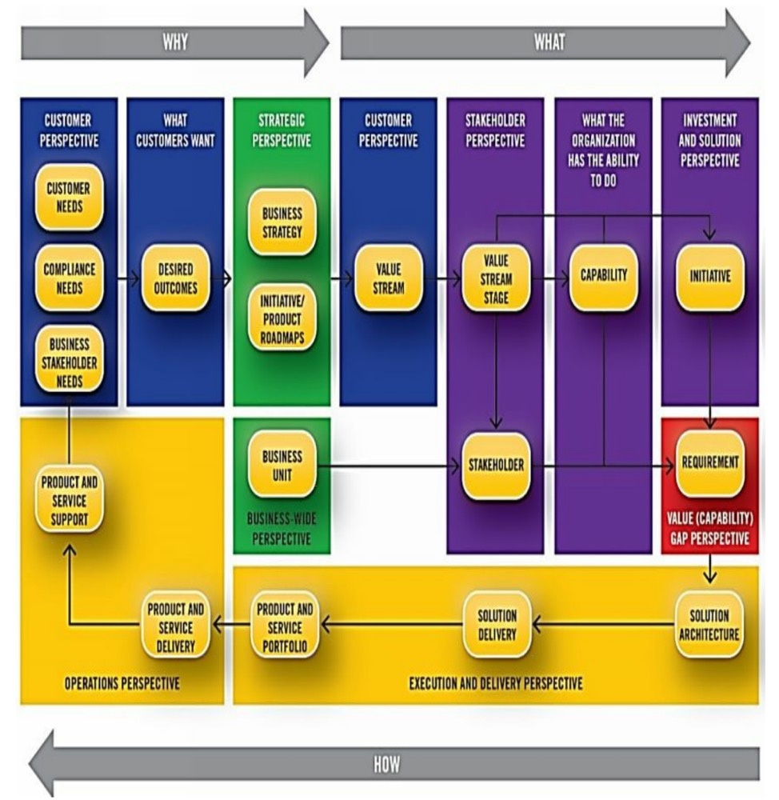
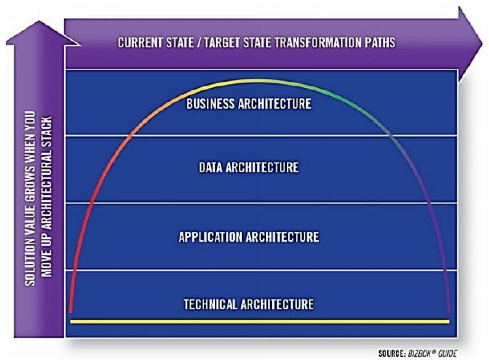
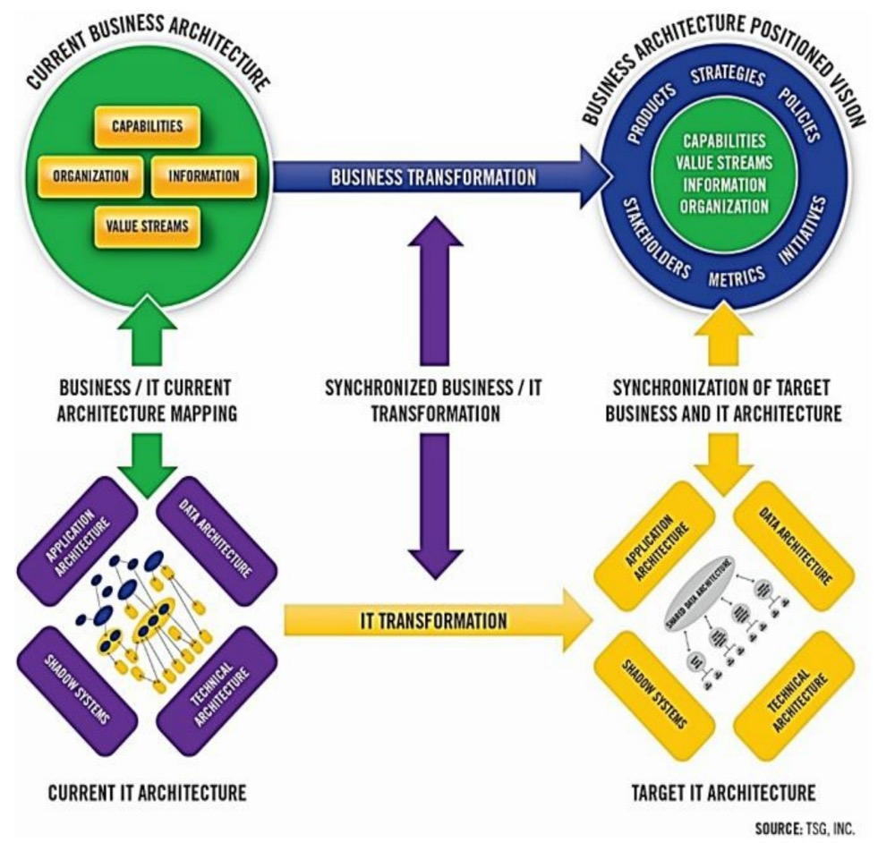

     本章的内容概述了业务架构在启用和改进与业务设计、规划和优化相关的学科方面所发挥的作用。这些相关学科包括：

- 业务绩效管理 

- 业务流程管理 

- 案例管理 

- 需求管理 

- 业务驱动的业务/IT架构对齐

  业务架构从本质上放大了这些领域的业务投资价值，确保这些投资是基于共享的业务视角和绝对的业务透明度共同进行的。

## 业务架构和业务绩效管理 

​        业务绩效管理是对一个组织在实现其业务目标方面的进展进行监控、度量和报告的做法。它通常使用平衡计分卡等技术来完成。[16] 事实证明，业务绩效管理本身对于那些希望通过正式的度量过程来定义、展示和监测业务绩效的组织是非常有用的。然而，组织经常面临的一个挑战是试图了解对其成功最重要的几个组织和绩效指标。部署大量的衡量标准往往是自取灭亡，甚至是适得其反。此外，不同的指标往往会相互竞争，特别是当它们被用来比较不同业务线的绩效或从相互冲突的业务角度得出的时候。

​        利用业务架构与业务绩效管理相结合，为企业提供了一个机会，以建立一套全面的、实用的、相关的衡量标准，并与企业的愿景、战略和相关目标紧密结合和追踪。业务架构为绩效提供了以下两个关键的视角，使业务和明确的业务目标之间有了具体、清晰的联系，而这些联系可能无法通过传统的衡量标准获得。具体包括：

1. 主要关注利用价值流为利益相关者创造价值。
2. 直接为利益相关者提供价值的关键能力的可见性。

​        以下绩效评级指标利用业务架构的能力和价值流领域，来评估业务目标和相关举措的相对业务影响和相关因素。这些指标在准确定位业务弱点和需求方面具有前瞻性，并针对业务效能、覆盖广度、相关影响和自动化水平，这些都是由一个或多个目标或举措所构成的。

​       请注意，指标评级方案的结构是允许团队将一组效能、影响、覆盖广度和自动化指标评级汇总，成为一个特定业务目标或举措的单一指标。例如，5分的综合评级意味着低优先级的投资，而1分的综合评级意味着高优先级的投资。下面的文字描述了由业务架构贡献的每一个额外的绩效指标。

#### 业务效能 

​       业务效能指标是反映受某些业务目标或举措影响的能力和价值流的总体质量和效能的总体或综合度量。效能指标来自于第4章中提到的能力和价值流热度映射。效能评级的范围包括从高效、正确、及时、满足所有期望的一端，延伸到低效、基本不正确、不及时、不满足合理期望的另一端。完全没有实施一个企业认为必要的特定能力，是最坏的情况。

​       业务效能分析检查目标能力和价值流阶段，并根据上述评级标准对其进行评级。热力图技术可以应用于一个能力或特定能力实例的汇总、跨业务视图。热力图中产生的彩色编码评级可以表示为指标，例如，红色或非常差的评级为2分，而绿色或非常好的评级为5分。 效能指标根据需要在受影响的能力和价值流阶段中进行汇总，以评估与特定目标和举措相关的业务需求和价值。

​        例如，如果一个项目针对的是一系列低绩效的能力，那么该项目很可能是一个更高业务优先级项目，并且比业务表现有效的项目需要更多的资源投入。效能评级不是在真空中工作，这一点是其他指标发挥作用的地方。

#### 业务影响 

​         业务影响是由一个能力或价值流阶段对业务的相对重要性决定的。例如，当一个能力或价值流阶段的成功或失败将对企业产生重大影响时，该能力或价值流阶段就具有高影响。例如，评级为5，表明一个能力或价值流阶段对业务的影响可以忽略不计，因为它很少发生，对外部利益相关者没有影响，对内部利益相关者的影响也有限。相反，评级为1，意味着一项能力对广泛的外部利益相关者造成影响，并且经常发生。例如，一个每天对客户进行评级并可能影响信用分数的账户风险确定能力，由于其频繁使用和面向客户的性质，将被视为高影响。

#### 覆盖广度 

​      覆盖广度指标是指一项能力在多个价值流的不同阶段出现的次数，主要考察该能力在整个企业中的复用程度。例如，5分代表在受影响的能力、价值流和利益相关者方面覆盖的业务广度非常有限，而1分代表在价值流、能力和受影响的业务单元方面覆盖的业务广度显著且影响深远。覆盖广度指标与业务影响评级指标不同，因为一项能力可能在许多价值流中被引用，但没有外部利益相关者的接触，而且仍然不经常发生。组织应该监测那些最普遍的能力和价值流，因为在一个广泛覆盖多个业务领域的领域中的投资，可能会比狭隘地专注于一个业务单元或价值流的投资产生更大的回报。

#### 自动化水平

​      自动化指标评级对与当前状态能力相关的自动化程度和这些能力促成的价值流阶段进行评分。例如，自动化等级为5，反映了有效的自动化能力，而等级为1反映了手动能力或自动化仅限于少数领域。自动化评级需要一定程度的能力与IT架构交叉映射，以评估一个给定的能力在哪里以及在何种程度上是自动化的。

#### 绩效指标评级汇总 

​       在投资组合经理或其他高管评估如何对整个项目组合进行最佳评级场景下，将一组绩效评级指标汇总到一个单一的数字是非常有用的。另外，高管们也可以在一项举措提出之前，评估一组目标的相对价值。在这种情况下，绩效指标有助于在一个特定的计划或项目形成之前，为企业设定投资重点，并确定优先次序。没有任何一个指标或一组指标应该被孤立地看待，但对于一个必须每年对几十或几百个项目和投资进行优先排序的大型组织来说，这些指标在快速分流低优先级的目标和项目，同时突出那些需要更仔细审查的目标和项目方面发挥着关键作用。

## 业务架构和业务流程建模与管理 

​       业务架构提供了一个组织保证其战略意图与执行该意图的业务流程对齐的框架。然而，这种调整并不涉及直接的、一对一的映射。如果没有对业务架构和业务流程管理领域之间的关系和动态的深刻理解，一个学科的知识和熟练程度不会自动导致另一个学科的最佳结果。业务架构和业务流程管理的从业人员提出了如下问题：

- 业务架构如何能帮助识别高价值的流程改进对象？

- 业务架构的终点和业务流程管理或优化的起点在哪里？

- 实践者何时会从使用详细的业务架构描述转变为利用业务流程管理技术？

​      流程优化在帮助简化操作和提高效率方面为企业提供了相当好的服务，但要超越这些增量收益，就需要对企业有一个更具战略性的架构观点。后一种观点需要在一个流程无法代表的层面上检查业务生态系统，因为业务架构是多维的，根据使用场景和业务利益从许多角度同时观察业务。将业务架构实践与业务流程管理结合起来有很多好处，包括：

- 提供一个更有效的方法来追踪业务战略和执行该战略的流程 
- 在企业层面上建立一个流程治理的框架 
- 为业务流程团队提供一个更有效的手段来获取真正的业务价值。 
- 使得多个团队能够从其他团队的流程改进中受益。 
- 指出与能力相关的业务弱势和限制，这预示着潜在的流程改进机会。

​       业务流程与核心业务架构概念（如价值流和能力）有着共生的关系。价值流提供了一种新的方式来看待流程，不受产品线、业务部门或合作伙伴边界、流程复杂度或技术的限制。通过使用价值流，企业可以更好地计划、定位和管理业务活动，其中主要的重点是利益相关者的价值交付。价值流阶段，反过来，由能力来实现。业务流程实现了使这些阶段得以实现的能力，其中流程提供了关于改进、调整、标准化和自动化工作的详细观点，以改善由业务架构确定的问题。价值流提供了一种架构方法来看待和思考流程。一个单一的价值流阶段映射到一个或多个业务流程。这种映射代表了关于如何将一个单一的业务活动分离到一个组织的结构方式中的操作决定。

​       价值流，像流程一样，从左到右移动，共享相同的最终目标，试图为企业完成一些事情。一个主要的区别是，价值流是专门为触发的利益相关者（如客户）实现最终状态的价值主张，以及在每个价值流阶段实现的增量价值。价值流并不关注为实现该价值而在途中参与的过程。当考虑到许多组织内的跨业务单元的流程冗余时，一个特定的企业可能有数百个业务流程，而根据商业模式的复杂性，只有二十个左右的价值流。图 6.1 是航空公司的 "旅行 "价值流（如之前在快速指南中提到的）和所选业务流程之间关系的一个例子。

​									**Figure 6.1: Value Stream / Business Process Cross-Mapping** 

​        旅行价值流容纳并包含了所有的票务行程，通过每段行程的准备、出发和到达进行循环，直到行程结束。图6.1显示了出发阶段的所有流程。例如，被称为 "授权旅客过境 "的过程包括安全、海关和移民检查。此外，图6.1描述了 "改变旅行者的行程安排 "流程在准备出发、出发和到达目的地的价值流阶段中的参与。这个流程包括座位、航班和其他基于出现的情况的可能变化。

​       业务架构为企业提供了一个高层次的整体视图，可用于确定流程改进的优先次序。业务流程管理提供了实现架构愿景所需的业务洞察力。例如，图6.1所示的价值流和流程调整的例子，可以用来帮助同步跨业务部门的投资，以简化旅行者的行程变化。这两种做法的最佳方式是，通过相互承认各自的优势和劣势，让其中一个为另一个提供信息。

## 业务架构和案例管理 

​       案例管理提供了一种在多维复杂环境中开发业务解决方案的手段。它是一种管理与案例相关信息的所有方面工作的方式，如保险单、服务合同、贷款、投资基金或客票。案例管理被定义为 "通过将所有相关部分组织到一个地方（称为案例）来协调工作的方法或做法"。[17] 

​        案例管理在历史上一直与一些行业的子集有关，如法院系统或医疗保健，但该学科已被普遍接受，成为提高业务效率、利益相关者价值、工作可追溯性、可审计性、可扩展性和质量的一种手段。案例管理通过向业务设计和相关解决方案提供完全的透明度和高度的敏捷性来实现这些价值主张。

​        例如，案例管理使一个 "案例 "能够在复杂的商业环境中转换，在其生命周期的任何时候，对案例的任何工作都可以追踪。从采用案例管理中获益最大的商业环境的典型特征是：大量的知识工作者、复杂的业务场景和一定程度的不可预知性，这是传统的流程建模技术所不能适应的。如果一个事件和相关的行动可以在一个给定的环境中发生，那么它只是另一个工作转换。相比之下，业务流程建模中的异常处理有升级复杂度的趋势，同时在组织应对现实世界的能力中留下缺口。

​        案例管理从一个结构化的、整体的业务视图中获益，以最大限度地提高敏捷性和透明度。业务架构为设计和部署案例管理解决方案提供了一个正式的视角，而不是局限于某个特定的业务部门或其他受限的视角。换句话说，业务架构提供了一个理想的环境，通过建立案例管理设计和解决方案的框架：

- 一个端到端，价值驱动的客户视角，利用价值流来限定事件和必要的业务条款 。
- 一个正式定义的业务对象，作为工作相关的焦点，针对合同、客户、合作伙伴、产品、许可证。
- 一个业务友好的状态管理方法，反映并利用业务对象的状态变化和这些对象在价值流中的相关转换 。
- 一个明确的利益相关者参与点，作为跟踪工作的基础 。
- 一个与正式业务对象相一致的基础信息管理环境 。

​      在业务架构的背景下，**构建案例管理的核心是 "基于规则的动态路由地图"**，或称路由地图，它由价值流和相关价值流阶段构成。路由地图详细说明了一种基于状态的方法，在价值流中和跨价值流中管理、跟踪和路由一个案例。图6.2描述了一个与价值流阶段相关的路由地图的例子，这个阶段被称为 "批准贷款"，在一个名为 "获得贷款 "的价值流中。

​															**Figure 6.2: 例子：基于规则的动态路由地图** 

​        图6.2所示的路由地图例子用数字描述了事件。批准贷款阶段是这个地图的重点。每个地点代表了一个进行工作的利益相关者或业务单元，在三个阶段中的每个阶段都用方框表示。每条线代表从一个地点到另一个地点的工作流程转换。带编号的 "转换指示器 "代表了启动工作流程转换的一对多的事件和要采取的行动。与能力成果相对应的事件，启动了一个地点内的转换、从一个地点到另一个地点、以及从一个阶段到另一个阶段的转换。阶段与阶段之间的转换和相关的状态变化也满足价值流阶段入口和出口标准。

​       例如，图6.2中的事件转换指示器1，对应于一个状态变化，一个来自状态管理能力的结果。在这种情况下，贷款申请变为 "已验证 "状态，导致一个事件触发了从贷款管理员工作队列到未分配工作队列的工作转换。这个转换恰好满足验证申请阶段的退出标准。在批准贷款阶段，事件转换指示器3触发了对合同管理员的工作请求，而转换指示器9代表贷款管理员工作队列中的工作转换。

​        路由地图是底层路由图工作表的图形表示，它详细说明了事件、工作转换、状态变化、要采取的行动以及其他与基于事件的工作流程环境相关的条件。这里没有显示路由地图工作表，但它包含在BIZBOK®指南中，它包含了关于基于事件的工作流的更多详细信息，通常由业务分析师和解决方案架构师制作和使用。

​        对于已经采用业务架构的企业来说，案例管理为设计一个高效的、独立于行业的工作流环境提供了一个替代方法。对于寻求投资于案例管理解决方案的企业来说，业务架构提供了一个宝贵的视角，即如何设计在整个企业中扩展的业务解决方案，以价值流为框架，并通过正式定义的能力来实现。在缺乏业务架构的情况下，案例管理解决方案可能会因为缺乏业务视角、严谨性以及横向和纵向扩展能力而受到影响。

## 业务架构和需求对齐 

​        业务需求代表了描述业务需要的核心表达方式。有许多方法来收集、阐述和实现业务需求，范围从 "瀑布"，即所有的需求被收集并作为一个预定的批次来实施，到 "敏捷"，即需求在一系列递增的交付窗口中不断发展。在实践中，许多组织应用这些方法的混合变体，在纯瀑布和纯敏捷之间的某处着陆。在所有情况下，需求必须是明确的、高度集中的陈述，清楚地定义具体的业务诉求。

​       定义不清的需求是导致项目失败的首要问题。虽然新的方法已经改善了需求的结构和清晰度，但如果需求分析没有在业务架构提供的更广泛的生态系统视角下进行，那么需求分析的投资将继续存在被误导、范围狭小和不明确的风险。

​      无论采用什么样的需求定义方法，业务架构允许企业在一个明确定义的范围内构建需求。具体来说，业务架构使业务分析团队能够更简洁地指定需求，将需求追溯到战略，并提供一个工具，将需求定位为可重用的组织资产。

​      考虑这样一个场景：业务分析师被要求为一个新的保险产品开发需求。业务架构的产品映射技术允许分析师识别建立一个准备上市的产品所需的能力。这些能力包括协议、索赔、风险、客户、市场、合作伙伴、公司政策和渠道管理，这反过来又指向受影响的价值流。价值流影响分析指出了参与该价值流的内部和外部利益相关者的关注面，因此，是需求分析的目标。简而言之，业务架构允许分析师确保需求解决不同的业务影响，反映明确的范围，保持明确的重点，并由业务专家进行调整。

​       错误的业务分析工作是很常见的，通常会导致项目时间的延长，成本的增加，不良的需求定义，和无效的解决方案。当一个企业在给定的价值流、相关的利益相关者和使能能力的环境下构建业务需求时，团队可以迅速集中他们的努力，缩小他们的分析范围，保持对问题陈述和解决方案的聚焦，并提供由业务架构紧密约束的需求。这种努力避免了需求的 "范围蠕变"，增加了成功实施一个良好的业务需求的可能性和及时性，避免因为需求沟通不畅而导致的大量返工。

​       正如在前面的例子中所提到的，在需求团队参与之前就应该开始制定业务需求--在战略规划和产品规划层面。图6.3反映了业务架构从规划到需求定义到部署的端到端作用。业务架构使企业能够放大并可视化整体业务影响，并关注在价值流、能力、利益相关者、举措和解决方案环境下的一组详细需求。这种端到端的、从战略到解决方案的可追溯性确保了每一个需求都可以追溯到一个战略目标，而这是业务分析工作中经常缺乏的观点。

​												**Figure: 6.3: Business Architecture-Framed Requirements Traceability** 

​     使用业务架构进行需求管理，也允许参考以前阐述的业务需求，并在不同的项目和业务单元中重复使用。在历史模式中，需求被视为一次性的，被抛弃的制品。这种复用的概念将需求定义从历史模式中转移出来。业务架构为扩大这种节省时间的方法提供了基础框架，并通过将每个需求与业务能力联系起来，在跨项目和业务单元中保持一致性。

​       利用业务架构，从端到端的角度对业务需求进行限定、框定、调整、重用和跟踪，代表了业务分析的根本转变，将其从一个战术性的、通常是孤立的观点，转变为端到端战略部署中的一个战略推动者。

# 业务架构和IT架构对齐

​     业务/IT架构对齐代表了自动化系统和数据架构充分实现业务战略、业务能力和利益相关者价值的状态。[19] 这门学科关注将业务战略、愿景、设计和需求转化为可部署的IT架构概念和技术解决方案。业务架构增强了这一活动，因为能力、价值流和信息与IT应用和数据架构有直接的、可追踪的和明确的关系。因此，与业务架构的一个特定方面相关的目标和要求可以直接与IT架构的影响联系起来。

​      IT架构的四个方面共同实现了业务能力、价值流和信息概念的自动化，同时由业务战略驱动。它们包括：

1. 应用架构代表了基于技术的自动化的规范和结构划分，包括业务逻辑、用户体验和数据观点，作为业务架构和战略的推动者。
2. 数据架构代表了定性和定量变量的价值规范的整合，以及它们与业务架构和战略的对齐[21]。
3. 技术架构代表了基础设施元素的逻辑和物理互连，以实现数据架构、应用架构、业务架构和战略的部署和管理。[22] 
4. 影子系统被定义为不在IT管理之下的任何企业拥有的、企业维护的技术。[23] 影子系统在IT转型工作中经常被忽视，因为它们被嵌入到业务中，超出了IT的视线，但这种系统在大多数业务生态系统中发挥着关键作用。

​        对大多数组织来说，一个主要的挑战是发展和改造反映业务、应用、数据和技术的 "企业 "架构的整体集合。与IT相关的架构最重要的考虑是确保这些架构的投资和演进背后有业务驱动力。 

​        图6.4描述了 "彩虹模型"，它代表了组织持续进行的演化转型。转型路径从左到右移动，表示从当前状态到目标状态的迁移，每一个目标转化代表一个新的或修订的目标状态。当转型更加关注对业务有更大影响的架构时，就能实现更多的价值。当应用和数据架构演变时，企业会立即注意到，因为正如这些架构的定义所指出的，这些架构使业务架构自动与战略保持一致。当技术架构是IT投资的唯一或主要焦点时，企业很少或没有看到直接价值。

​                       **Figure: 6.4: Business Architecture and IT Architecture Transformation “Rainbow Model”** 

​        当组织通过遵循图6.4所示的彩虹路径从当前状态转移到目标状态时，他们会使这些投资的价值主张最大化。相反，当一项重要的投资只穿越技术架构时，商业价值就会降到最低。为了使IT的商业投资最大化，高管们应该寻求从业务角度来推动IT投资，通过业务架构的框定和业务战略的驱动。

​       确保业务战略推动IT架构转型需要业务/IT架构对齐。企业利用业务架构来确定某些能力和价值流的弱点和优势，确定各种业务战略的具体影响，并阐明业务专业人员。业务驱动、业务/IT架构对齐的好处包括：

- IT投资是由业务驱动的，有明确的业务投资回报率（ROI） 

- 业务可以将IT投资的重点重新放在利益相关者的价值交付和业务能力上，而不是历史上对系统和平台的关注
-  IT战略很容易与业务单元、产品和相关边界的业务战略保持一致，并由其驱动。确保协调的IT解决方案 
- IT投资关注于能力和技术方面的弱点、差距和相关限制的整体观点 
- 转型路线图代表业务和IT，用于投资优先级的确定、变革管理和影响评估 

​        图6.5显示了整体的业务和IT转型观点。 这个 "转型框架 "代表了转型的四个阶段，企业通过重复的、渐进的旅程，从当前状态到目标状态。

 

​				**Figure: 6.5: Business Architecture / IT Architecture Transformation Framework** 

​     图6.5强调了建立业务架构基线（左上）和未来状态业务愿景（右上）的重要性。它还强调了理解业务架构如何与当前状态的IT架构相联系的重要性（左下），同时推动目标状态的IT架构的定义（右下）。整体来看，通过一系列从当前状态到目标状态的迁移，认识到了业务和IT同步转型的重要性。在实践中，企业应该将IT投资和举措规划从技术驱动的决策标准转向业务驱动的决策标准。例如，一个系统可能是老旧的，在一个陈旧的平台上，但如果它的自动化能力被评为合理有效且影响不大，那么IT投资应该被重新定向到无效的、高影响的能力上。之前在第6章中定义的业务绩效指标提供了对这些分析的见解。

# 跨学科的协调： 对最大化业务架构的价值至关重要 

​     当组织在业务绩效管理、业务流程管理、案例管理和需求管理的背景下利用业务架构时，他们发现它增强了他们从端到端解决方案交付角度提供真正价值的能力。同样，当业务架构被用来使企业从业务的角度推动IT投资时，投资回报率的论证就变成了业务讨论，而不是技术讨论。随着企业正式确定其业务架构基线，跨学科的协调机会就会出现。正如第3章所讨论的那样，建立一个业务架构参与模型，为跨学科的协调提供了一个整体参考框架。
